## DPR运行笔记

by Sunlly

2022.6.16

论文：《Dense Passage Retrieval for Open-Domain Question Answering》 2020

github代码：https://github.com/facebookresearch/DPR

---

### 步骤

1. 创建新容器：
```
docker run -itd -m 10g -v [宿主机目录]:[容器目录] --gpus all --name [容器名] --shm-size="2g"  pytorch/pytorch
```
2. 创建目录和git clone项目
```
git clone git@github.com:facebookresearch/DPR.git
cd DPR
```
3. 安装依赖：

```
pip install .
```
4. 运行：
```
python train_dense_encoder.py \
train_datasets=[list of train datasets, comma separated without spaces] \
dev_datasets=[list of dev datasets, comma separated without spaces] \
train=biencoder_local \
output_dir={path to checkpoints dir}
```
使用 nq 的数据集作为测试：

```
python train_dense_encoder.py \
train_datasets=nq-train.json \
dev_datasets=nq-dev.json \
train=biencoder_local \
output_dir=test_nq_20220616
```

修改 train_dense_encoder.py 的 args 后可以直接运行和调试。

### 问题

1. 运行 train_dense_encoder.py

报错：OSError: [E050] Can't find model 'en_core_web_sm'. It doesn't seem to be a Python package or a valid path to a data directory.

原因：包下载有问题

解决： 尝试 python -m spacy download en_core_web_sm 无效；

下载：https://github.com/explosion/spacy-models/releases/download/en_core_web_sm-3.3.0/en_core_web_sm-3.3.0-py3-none-any.whl

安装：pip install en_core_web_sm-3.3.0-py3-none-any.whl

安装成功

### 处理记录

**1. 将 wikisql 训练集、测试集做处理，训练 DPR**

处理数据集，将 前面筛除过的 test 集 中的table，出现过的table 保留，没有出现过的table删除(wikisql_remove_tables_out100.py)，形成新的 test.tables.jsonl(test.tables_remove_out100.jsonl)

test.tables.jsonl
total: 5230个表
count: 4628
remove: 602

修改 wikisql_generatedata 的代码，用 WikiSQL 生成符合 dpr 训练数据形式的数据集，格式如下：
```
[
    {
        "dataset": "nq_dev_psgs_w100",
        "question": "who sings does he love me with reba",
        "answers": [
            "Linda Davis"
        ],
        "positive_ctxs": [
            {
                "title": "Does He Love You",
                "text": "Does He Love You \"Does He Love You\" is a song written by Sandy Knox and Billy Stritch, and recorded as a duet by American country music artists Reba McEntire and Linda Davis. ",
                "score": 13.394315,
                "title_score": 0,
                "passage_id": "11828866"
            },
            {
                "title": "Red Sandy Spika dress of Reba McEntire",
                "text": "Red Sandy Spika dress of Reba McEntire American recording artist Reba McEntire wore a sheer red dress to the 1993 Country Music Association Awards ceremony on September 29, 1993.",
                "score": 12.924647,
                "title_score": 0,
                "passage_id": "15632586"
            }
        ],
        "negative_ctxs": [
            {
                "title": "Cormac McCarthy",
                "text": "chores of the house, Lee was asked by Cormac to also get a day job so he could focus on his novel writing. ",
                "score": 0,
                "title_score": 0,
                "passage_id": "2145653"
            },
            {
                "title": "Pragmatic Sanction of 1549",
                "text": "one heir, Charles effectively united the Netherlands as one entity. ",
                "score": 0,
                "title_score": 0,
                "passage_id": "2271902"
            }
          ]
        },
        {
          "dataset": "nq_dev_psgs_w100",
          "question": "who sings does he love me with reba",
          "answers": [
              "Linda Davis"
          ],
          ...
        }
]
```

根据代码的 github 网站上所述，其实score 是没有在模型中用到的，但是包含在了数据集内。

** 不确定bm25的负样本是如何融入到模型的训练中去的

写了一个处理数据集的代码，将原数据集/筛选过后的数据集修改成DPR 的输入数据集：(data_generate_dpr.py),自己定义了标签名：

```python
neg_tables=[]
for i in range(neg_num):
    random_idx=random.randint(1,len(tables_ids))-1
    # print("random_idx:",random_idx)
    random_table_id=tables_ids[random_idx]

    while random_table_id == origin_table_id:
        random_idx=random.randint(1,len(tables_ids))-1
        random_table_id=tables_ids[random_idx]

    random_table_content=tables[random_table_id]

    neg_sample={}
    neg_sample["table_id"]=random_table_id
    neg_sample["content"]=random_table_content
    neg_tables.append(neg_sample)


item_out={}
item_out["dataset"]="wikisql_"+phase
item_out["question"]=raw_sample['question']
item_out["answer"]=[raw_sample["sql"]]
item_out["positive_ctxs"]=[pos_sample]
item_out["negative_ctxs"]=neg_tables

item_out=json.dumps(item_out)
f.write(item_out)
```

对于 negative_ctxs，在 table 中随机取 20 个，对应训练时的 batch

**（但是不太清楚dpr 原代码的实现中是如论文所说的 in-batch 的训练，即负样本取自 数据集中的 negative_ctxs ，还是同 batch ）

修改dpr 原代码中，标签名载入部分的代码：
```python
class JsonQADataset(Dataset):
...
  def create_passage(ctx: dict):
      return BiEncoderPassage(
          ## 改标签名 by Sunlly
          # normalize_passage(ctx["text"]) if self.normalize else ctx["text"],
          # ctx["title"],
          normalize_passage(ctx["content"]) if self.normalize else ctx["content"],
          ctx["table_id"],
      )
```

运行 train_dense_encoder.py 开始训练模型

问题：
由于table的 token 过长，输出警告：意思是会将超过的 table token截去，只保留前面的

**（论文上也提到了这一点，将 过长的 passage 分成多段，并且训练样本 passage 的长度最好一样）
```
Be aware, overflowing tokens are not returned for the setting you have chosen, i.e. sequence pairs with the 'longest_first' truncation strategy. So the returned list will always be empty even if some tokens have been removed.

```

解决：加入头文件
```
import transformers
transformers.logging.set_verbosity_error()
```
其含义：只报告错误信息，将详细程度设置为ERROR级别。

** 但是，截取表格后，表格内容信息不完整，会不会影响表格性能？（希望模型能学习到如果 question 和内容有token 相同，他们的相似度会更高 这一点）

** 技巧：dpr 通过log 打印了输出日志，效果比 nohup 的好，后续可以学一下。

在wikisql上训练后，用 test 做评估，结果不太理想：

仅在 test 的 pos/neg 样本上做测试，
correct prediction ratio  4541/13216 ~  0.343599

**2. 下载官方的模型检查点，生成 embeddings（将 passage 编码为向量形式）**

由于上面的模型效果不好，决定先用官方训练好的模型先把代码跑通。

下载官方检查点：

```Python
  "checkpoint.retriever.single.nq.bert-base-encoder": {
      "s3_url": "https://dl.fbaipublicfiles.com/dpr/checkpoint/retriever/single/nq/hf_bert_base.cp",
      "original_ext": ".cp",
      "compressed": False,
      "desc": "Biencoder weights trained on NQ data and HF bert-base-uncased model",
  },
```

修改 generate_dense_embeddings.py 中的配置参数：

```Python
def main(cfg: DictConfig):

    ## add args by Sunlly
    # cfg.model_file="/nlp_files/DPR/outputs/2022-06-16/08-59-29/test_nq_20220616/dpr_biencoder.3"
    cfg.model_file="/nlp_files/DPR/model/hf_bert_base.cp"
    # cfg.ctx_src="/nlp_files/DPR/nq-dev-small.json"
    # cfg.ctx_src="/nlp_files/DPR/downloads/data/wikipedia_split/psgs_w100.tsv"
    cfg.ctx_src="dpr_wiki"
    cfg.out_file="/nlp_files/DPR/embeddings/nq"
```

修改 default_dources.yml:

```
dpr_wiki:
  _target_: dpr.data.retriever_data.CsvCtxSrc
  # file: data.wikipedia_split.psgs_w100
  file: "/nlp_files/DPR/downloads/data/wikipedia_split/psgs_w100.tsv"
  id_prefix: 'wiki:'

dpr_nq:
## 用于编码的text 形式
  _target_: dpr.data.retriever_data.CsvQASrc
  # file: /nlp_files/DPR/nq-dev-small.json
  file: /nlp_files/DPR/nq-test.csv
  # id_prefix: 'nq-small:'
```
注意： cfg.ctx_src 不能直接指定路径，需要在 default_dources.yml 中去找。如果是 dpr_wiki 并指定 `file: data.wikipedia_split.psgs_w100` 会自动下载 psgs_w100.tsv（12G）。没有用 nq 的数据集，此处相当于先用官网的例子跑通。

tsv 文件例子：


**后续可以按照 tsv 的格式构建 tables 的数据集。

修改了 gen_embs.yaml，用处不大。

修改了原代码中的 end_idx：
```Python
# end_idx = start_idx + shard_size
end_idx=start_idx +200
```
因为只想跑个例子，原数据集的 passage 太多了。所以相当于只取了前 200条生成 ctx 向量。

开始跑代码：
```
python generate_dense_embeddings.py
```

生成的向量结果在 embeddings 中，是个打不开的二进制文件


**3. 根据生成好了的 ctx 向量，编码问题做检索**

代码在 dense_retriever.py。

修改配置：

```Python
@hydra.main(config_path="conf", config_name="dense_retriever")
def main(cfg: DictConfig):
    cfg = setup_cfg_gpu(cfg)

## add args by Sunlly
    cfg.model_file="/nlp_files/DPR/model/hf_bert_base.cp"
    cfg.qa_dataset="nq_test"  #/nlp_files/DPR/conf/datasets/retriever_default.yaml
    cfg.ctx_datatsets=["dpr_wiki"] ## need [] is a dict
    cfg.encoded_ctx_files=["/nlp_files/DPR/embeddings/nq_0"] ## need [] is a dict
    cfg.out_file="/nlp_files/DPR/retriever_validation"
```

retriever_default.yaml:
```
nq_test:
  _target_: dpr.data.retriever_data.CsvQASrc
  # file: data.retriever.qas.nq-test
  file: "/nlp_files/DPR/nq-test.csv"
```

遇到问题：

IndexError: Dimension out of range (expected to be in range of [-1, 0], but got 1)

解决：按：https://github.com/facebookresearch/DPR/issues/213

修改代码：顺利解决

```Python
# max_vector_len = max(q_t.size(1) for q_t in batch_tensors)
# min_vector_len = min(q_t.size(1) for q_t in batch_tensors)
max_vector_len = max(q_t.size(0) for q_t in batch_tensors)
min_vector_len = min(q_t.size(0) for q_t in batch_tensors)
```

run code:


```
python dense_retriever.py
```
结果：


找到了前 100 个匹配的 passage，由于数据集和 question 其实是对不上的，所以无法评估正确率。

检索的参数具备 score，可以用于后续的 rerank。

可以在 dense_retriever.yml 中设置检索的 passage 数量：


###  运行 NQ-table retrieval

**1. 下载 nq-table 模型检查点，根据生成好了的 ctx 向量，编码 nq-table**


nq_table 数据集 tables 部分示例：

```json
{
    "columns": [{
        "text": ""
    }, {
        "text": ""
    }, {
        "text": "Born"
    }, {
        "text": "Residence"
    }, {
        "text": "Occupation"
    }, {
        "text": "Years\u00a0active"
    }, {
        "text": "Height"
    }, {
        "text": "Television"
    }, {
        "text": "Children"
    }],
    "rows": [{
        "cells": [{
            "text": "Lesley Joseph"
        }, {
            "text": "Joseph in Cardiff, Wales, May 2011"
        }, {
            "text": "Lesley Diana Joseph  14 October 1945 (age\u00a072) Finsbury Park, Haringey, London, England"
        }, {
            "text": "Hampstead, North London"
        }, {
            "text": "Broadcaster, actress"
        }, {
            "text": "1969\u2013present"
        }, {
            "text": "5\u00a0ft 2\u00a0in (1.57\u00a0m)"
        }, {
            "text": "Birds of a Feather"
        }, {
            "text": "2"
        }]
    }],
    "tableId": "Lesley Joseph_A1D55A57012E3362",
    "documentTitle": "Lesley Joseph",
    "documentUrl": "https://en.wikipedia.org//w/index.php?title=Lesley_Joseph&amp;oldid=843506707"
}
```

取 100 个 table 作为示例：修改 conf/ctx_sources/table_sources.yaml:
```
nq_table_raw:
  _target_: dpr.data.retriever_data.JsonlNQTablesCtxSrc
  # file: "/mnt/zhiruow/hitab/table-retrieval/datasets/nq_table/tables.jsonl"
  file: "/nlp_files/nqt-retrieval/datasets/nq_table/tables_small.jsonl"
  id_prefix: 'nqt:'
```
修改 generate_embedding.py 的参数配置：

```Python
def main(cfg: DictConfig):
    ## by Sunlly
    cfg.model_file="/nlp_files/nqt-retrieval/checkpoint/retriever/single-adv-hn/nq/bert-base-encoder.cp"
    cfg.ctx_src="nq_table_raw"
    cfg.out_file="/nlp_files/nqt-retrieval/embeddings/nq_table"
```

run code:
```
python generate_embedding.py
```

问题：
```
  ctx_src = hydra.utils.instantiate(cfg.ctx_sources[cfg.ctx_src])
```
报错， 经过检查后 ctx_src 是正确的。

解决：注释：
```Python
from dpr.data.biencoder_data import (
    BiEncoderTable,
    get_nq_table_files,
    get_processed_table,
    # get_processed_table_wiki,
    # get_processed_table_wqt,
)
```
问题：

报错：
```
if self.id_prefix: sample_id = self.id_prefix + sample['id']
```
sample not has 'id'
解决：
换 ctx_scr , 从 nq_table 到 nq_table_raw

问题：
biencoder_data.py
```
if max_cell_num: cell_list = cell_list[: max_cell_num]
```
发生异常: TypeError
slice indices must be integers or None or have an __index__ method

处理第一个表就报错。

解决：注释该句

问题：

table_data.py 中报错：
```python
for cell in cell_list:
    text = cell['text'].strip()
```
TypeError:
tuple indices must be integers or slices, not str

解决： 换成引用而不是切片

```Python
for cell in cell_list:
    # text = cell['text'].strip()
    text = cell.text.strip()
```

不知道为啥会有这个问题，可能是 python  版本不一样的原因。
下面又遇到错误，同样替换。
```Python
# row_ids.extend([cell['row_idx'] for _ in cell_token_ids])
# col_ids.extend([cell['col_idx'] for _ in cell_token_ids])
row_ids.extend([cell.row_idx for _ in cell_token_ids])
col_ids.extend([cell.col_idx for _ in cell_token_ids])
```

前 100 个 tables 处理完成：


另外，运行 process_table.py 可以处理表格，比如增加分隔符之类的。

**2. 基于 nq-table 的编码做检索**

从 nq_table_test 中取了 6 个问题做测试（nq_table_test_small.jsonl），其中最后一个比较长。

run code :
```
python dense_retrieval.py
```

也遇到同上问题（cell[...]），同理修改解决。

结果：（nq_table_test_small_result.jsonl）

```
{
    "question": "where does the brazos river start and stop",
    "answers": [
        "Llano Estacado",
        "Gulf of Mexico"
    ],
    "ctxs": [
        {
            "id": "nqt:Amazon River_4E0AC7C7AE20D8EE",
            "title": "amazon river",
            "text": "amazon river name | country | coordinates | image | hidenotes . allpahuayo - mishana national reserve | peru | 3 \u00b0 56\u2032s 73 \u00b0 33\u2032w\ufeff / \ufeff3.933 | [ 51 ] . amacayacu national park | colombia | 3 \u00b0 29\u2032s 72 \u00b0 12\u2032w\ufeff / \ufeff3.483 | [ 52 ] . amazo\u0302nia national park | brazil | 4 \u00b0 26\u2032s 56 \u00b0 50\u2032w\ufeff / \ufeff4.433 | [ 53 ] . anavilhanas national park | brazil | 2 \u00b0 23\u2032s 60 \u00b0 55\u2032w\ufeff / \ufeff2.383 | [ 54 ] .",
            "score": "65.01775",
            "has_answer": false
        },
        {
            "id": "nqt:Assiniboine River_75DCC362724ADC33",
            "title": "assiniboine river",
            "text": "assiniboine river location | peak flow , 1995 ( m3 / s ) | mean flow , april ' 95 ( m3 / s ) | mean flow , may ' 95 ( m3 / s ) | max flow , date ( m3 / s ) . russell | 360 may 4 | 34.2 | 46.3 | 504 april 29 , 1922 . brandon | 566 april 26 | 81.1 | 104.0 | 651 may 7 , 1923 . headingley | 300 april 20 | 115.0 | 142.0 | 614 april 27 , 1916 .",
            "score": "64.74672",
            "has_answer": false
        },
        {
            "id": "nqt:Indus River_78C7B2189DD8401",
            "title": "indus river",
            "text": "indus river [ show ] v t e hydrology of pakistan | [ show ] v t e hydrology of pakistan.1 . lakes | ansoo baghsar banjosa borith chitta katha dudipatsar hadero . rivers | indus astore bara basol braldu bunhar chenab dasht . coastal | indian ocean arabian sea gulf of oman . categories | lakes rivers .",
            "score": "60.91795",
            "has_answer": false
        },
        ...
```

由于只取了200 个表格，虽然检索出来的表格可能对不上，但是总体而言内容还是比较相关。

**3. 完整的 nq-table 数据集做编码和检索**

修改：conf/ctx_sources/table_sources.yaml 中的 file 为完整的 nq_table：

```
nq_table_raw:
  _target_: dpr.data.retriever_data.JsonlNQTablesCtxSrc
  # file: "/mnt/zhiruow/hitab/table-retrieval/datasets/nq_table/tables.jsonl"
  file: "/nlp_files/nqt-retrieval/datasets/nq_table/tables.jsonl"
  id_prefix: 'nqt:'
```

修改 generate_embeddings.py 中的 out_file,
```Python
cfg.model_file="/nlp_files/nqt-retrieval/checkpoint/retriever/single-adv-hn/nq/bert-base-encoder.cp"
cfg.ctx_src="nq_table_raw"
cfg.out_file="/nlp_files/nqt-retrieval/embeddings/nq_table"
```
运行：

```
nohup python \-u generate_embeddings.py
````

nq_table：共 168989 个表格，编码约用3.5 h。（近17万个表）

检索：

dense_retrieval.py

结果：

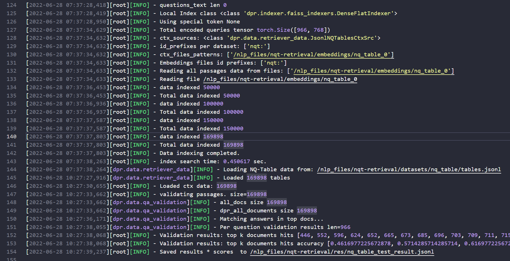

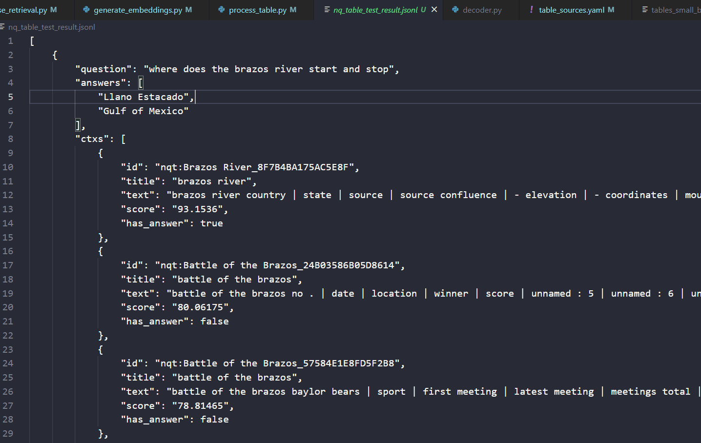

**4. 如何将 wikisql_table 以平铺或 加分隔符的方式，载入 dpr embedding?**

对wikisql 中 train/dev/test 中所有的表综合在一起，构建一个 wikisql_tables 集。

1. 剔除执行结果为空的 train/dev/test 的 question

|        | question | remove_none_answer |
| ------ | -------- | ------------------ |
| train  | 56355    | 52032              |
| dev    | 8421     | 7764               |
| test   | 15878    | 14599              |


2. 将原始的各tables文件（WikiSQL/data/train.tables.jsonl、dev.tables.jsonl、test.jsonl）全部合起来，形成wikisql_tables_process_bm25.jsonl。

bm25 的数据集处理过程如下：(table_process_process_bm25.py)

for  循环读取三个 pharse（）拼接 page_title(如果有) /header/ rows，增加 column 项。为了便于后续的区分，为id 增加前缀：train_/dev_/test_

然后全部合起来，形成总的 wikisql_tables 集（wikisql_tables_process_bm25.jsonl）

|        | origin_table_num |
| ------ | ---------------- |
| train  | 18585            |
| dev    | 2716             |
| test   | 5230             |
| total: | 26531            |

 全部导入 elasticsearch 中的 index=wikisql_tables(upload_table_data_test.py),结果：

 ```
 {'count': 26531, '_shards': {'total': 1, 'successful': 1, 'skipped': 0, 'failed': 0}}
 ```
 导入成功。

 **3. 基于剔除执行结果为空的 train/dev/test 的 question， 剔除三个数据集中 bm25 top100(数字值得商榷)的question 和table。**

修改 wikisql_elastic_python_test_remove_out100_tables.py
,**top_k 设置成 200**，bm25 为默认参数值，增加 phase 并运行（hisresult 增加 phase），结果：

train: 筛除 8698 个


dev:筛除 1406个问题


test:筛除 2543个问题


 |         | remove_none_answer | remove_bm25_out_ |
 | ------ | ------------------ | ---- |
 | train   | 52032              | 43334 |
 | dev        | 7764               | 6358 |
 | test      | 14599              | 12056 |


作为最后的 open_wikisql_question 集

去除筛选后保留的问题中没有包含到的表格 （wikisql_remove_tables_out200.py）


最后保留下来的表格有 22319 个，共移除 4212个。

 4. 创建 dpr 的表格数据。分两种情况：直接平铺和有分隔符。

table_process_total_process_dpr.py

修改：实现生成两种情况的table数据集
```
has_delimiters=True
```


26531 个表格-->22319个表格

同上面一样的方法筛除 table：


将以上筛除后的表格载入 elasticsearch

"data_preprocess/wikisql_tables_remove_out200_dpr_with_delimiter.jsonl"

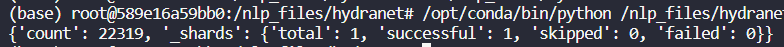


5. 生成 dpr 的 wikisql 训练数据形式的数据集

采用的策略是，neg:随机取61个 table，soft_hard_neg:检索 bm25 ，在top20 中随机取2个，pos:只有1个。 （data_generate_traindata_dpr_out200.py）

问题：检索的时候遇到：

elastic_transport.ConnectionError: Connection error caused by: ConnectionError(Connection error caused by: ProtocolError(('Connection aborted.', ConnectionResetError(104, 'Connection reset by peer'))))

貌似是检索太频繁导致的？

增加一个 sleep：
```
hard_neg_tables=get_tables(question,origin_table_id)
if cnt%10==0:
    print("cnt: ",cnt)
    time.sleep(0.1)
```

elastic_transport.ConnectionError: Connection error caused by: ConnectionError(Connection error caused by: NewConnectionError(<urllib3.connection.HTTPConnection object at 0x7f67d216c750>: Failed to establish a new connection: [Errno 111] Connection refused))

重启 es:
```
su esuser
./bin/elasticsearch
```

生成结果：带/不带 delimiter 的 training/testing ，共4个文件，将其挪到 host4的 DPR 的 wikisql_data 文件夹中

DPR/wikisql_data/wikisql_dpr_training_data_with_delimiter.json、/nlp_files/DPR/wikisql_data/wikisql_dpr_testing_data_with_delimiter.json

6. 用 raw dpr 训练 embedding 生成 dpr 的 wikisql 训练数据形式的数据集

问题：train 集的loss 下降， test 集的loss 上升？学习率也在上升。 eval 效果极差。

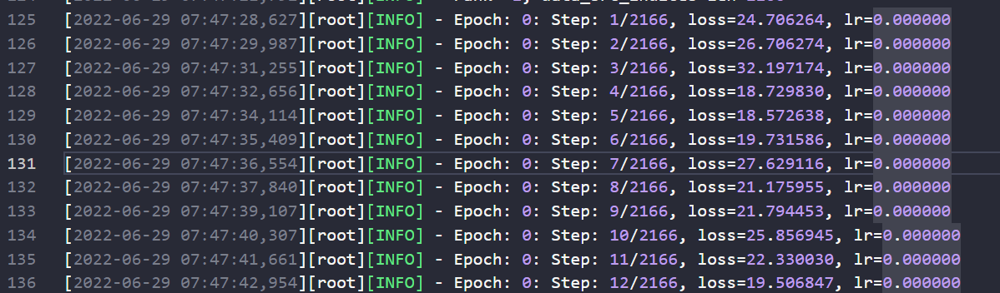
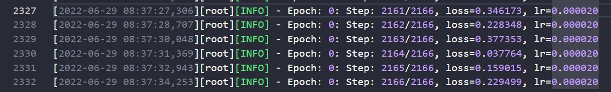
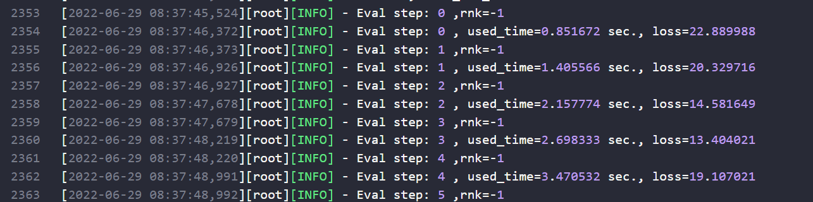

询问师姐说是过拟合。

后续将batch_size=1,调了 neg 的数量，训练集43334，测试集12048，平均loss=35.6,准确率 5/12048,效果极差

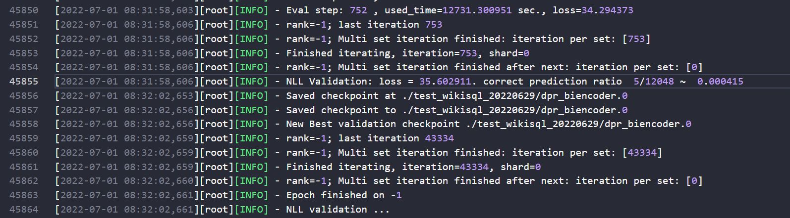

neg 的数量作用在哪，感觉没有什么效果。

在40000多的 trainset 间隔10个取了2000个问题的子集做训练，在test 上间隔10个取了200个子集做测评，再进一步降低了学习率。

后续testloss 正常下降了，eval 的效果（猜测是64 中取1）也达到了 54%

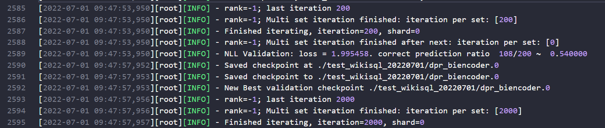

继续降低学习率做训练，同时将 drop_out从 0.1 调到了0.2，max_length 从 256到512。显存需要增加，导致 batch_size=1 都跑不起了。将 conf/train/biencoder_local.yaml的other_negatives调到 20。一个epoch 需40min 训练, 5min 测试。20epoch 自动停止。loss 分别为：

| epoch | train    | test     | test_acc            |
| ----- | -------- | -------- | ------------------- |
| 0     | 2.617569 | 2.219180 | 113/200 ~  0.565000 |
| 1     | 1.258608 | 1.907552 | 126/200 ~  0.630000 |
| 2     | 1.210599 | 1.711939 | **137/200 ~  0.685000 **|
| 3     | 1.280452 | 1.791353 | 132/200 ~  0.660000 |
| 4     | 1.126368 | 1.906223 | 131/200 ~  0.655000 |
| 5     | 1.113602 | 1.953571 | 127/200 ~  0.635000 |
| 6     | 0.917539 | 2.063476 | 126/200 ~  0.630000 |
| 7     | 0.948463 | 2.347768 | 124/200 ~  0.620000 |
| 8     | 0.937369 | 2.728052 | 115/200 ~  0.575000 |
| 9     | 0.601034 | 3.316344 | 107/200 ~  0.535000 |
| 10    | 0.658453 | 4.087913 | 99/200 ~  0.495000  |
| ...   | ...      | ...      | ...                 |
| 19    | 0.489357 | 7.573456 | 82/200 ~  0.410000  |


learning_rate: 5.0e-07
最好模型为：outputs/2022-07-01/13-09-01/test_wikisql_20220701/dpr_biencoder.2

典型的再往后就是越过拟合。后续两个方案：1. 调 drop_out，再试（0.2->0.1,0.2->0.3）2. 增大训练数据集的数据量（2000->4000，2000->6000）

用2000样本将drop_out 从0.2->0.1,  learning_rate: 5.0e-07, 最高 62%，后续测试集上性能下降。总体效果没有原来好。

用2000样本 drop_out=0.3 训练，  learning_rate: 5.0e-07。train loss=1.2+ ,test loss=2.187767，epoch 1结束 时准确率60%。后续暂停了训练。

用8000 样本，drop_out=0.2， learning_rate: 4.0e-07，  eval_per_epoch: 4（每隔2000样本测试1次。）  other_negatives: 20。epoch 刚一半时效果最高：NLL Validation: loss = 1.679720. correct prediction ratio  123/200 ~  0.615000。后续准确率极速下降。

用40000训练样本+500测试样本做训练，调learning_rate: 3.0e-07，gradient_accumulation_steps: 8，dropout: 0.2，目前epoch1 中的最好效果 311/500 ~  0.622000， 再往后性能下降。感觉学习率有点低。

2022.7.6

尝试了多次，模型及其容易过拟合。通过加载检查点的训练，最高 test acc=71%。发现当降低 other_negatives 的数量从 20->10 的时候效果好，说明模型可能不擅长分类 other_neg 样本。

通过分析可能是数据集的问题，重新生成hard_neg=1 other_neg=20 的例子，取 train=3000，test=500,在之前的检查点上重新做训练。

还有一个原因，可能是 问题的cfg.max_length太长了，导致模型过拟合。

**5. wikisql_table embedding 并做检索得到结果，对检索结果进行评估。**

embedding:

修改 default_sources.yaml:
```
dpr_wikisql:
  _target_: dpr.data.retriever_data.JsonlWikiSQLCtxSrc
  file: "/nlp_files/DPR/wikisql_data/wikisql_tables_remove_out200_dpr_with_delimiter.jsonl"
```

修改 dpr/data/retriever_data.py，自己写了一个加载数据的类，借用BiEncoderPassage,用 column_meta 当做其的 title 项。

```python
# by Sunlly
class JsonlWikiSQLCtxSrc(RetrieverData):
    def __init__(
        self,
        file: str,
        # id_col: int = 0,
        # text_col: int = 1,
        # meta_col: int = 2,
        id_col: str = "id",
        text_col: str = "content",
        meta_col: str = "column_meta",
        id_prefix: str = None,
        normalize: bool = False,
    ):
        super().__init__(file)
        self.text_col = text_col
        self.meta_col = meta_col
        self.id_col = id_col
        self.id_prefix = id_prefix
        self.normalize = normalize

    def load_data_to(self, ctxs: Dict[object, BiEncoderPassage]):
        super().load_data()
        logger.info("Reading file %s", self.file)
        with jsonlines.open(self.file) as r:
            for row in r:
                sample_id = row[self.id_col]
                passage = row[self.text_col].strip('"')
                ctxs[sample_id] = BiEncoderPassage(passage, row[self.meta_col])
```
修改 generate_embedding.py 使title 项（实际上的 column_meta）不加载入embedding

```Python
def gen_ctx_vectors:
    # batch_token_tensors = [
    #     tensorizer.text_to_tensor(ctx[1].text, title=ctx[1].title if insert_title else None) for ctx in batch
    # ]
    # by Sunlly dont load column_meta
    batch_token_tensors = [
        tensorizer.text_to_tensor(ctx[1].text, title="" if insert_title else None) for ctx in batch
    ]
```

修改 config，运行generate_dense_embeddings.py
```Python
# end_idx = start_idx + shard_size
# by Sunlly
end_idx=start_idx +200
```
```Python
def main(cfg: DictConfig):
    cfg.model_file="/nlp_files/DPR/outputs/2022-07-06/02-17-21/test_wikisql_20220706/dpr_biencoder.3"
    cfg.ctx_src="dpr_wikisql"
    cfg.out_file="/nlp_files/DPR/embeddings/wikisql_tables"
```
取前 200 个生成 embedding:

结果：
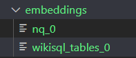

运行dense_retriever.py,暂时先用的 nq_test 作为 QA：
```python
cfg.model_file="/nlp_files/DPR/outputs/2022-07-06/02-17-21/test_wikisql_20220706/dpr_biencoder.3"
cfg.qa_dataset="nq_test"  
cfg.ctx_datatsets=["dpr_wikisql"] ## need [] is a dict   in default_sources.yaml
cfg.encoded_ctx_files=["/nlp_files/DPR/embeddings/wikisql_tables_0"] ## need [] is a dict
cfg.out_file="/nlp_files/DPR/wikisql_retriever_validation"
```
结果：
```
[
    {
        "question": "who got the first nobel prize in physics",
        "answers": [
            "Wilhelm Conrad R\u00f6ntgen"
        ],
        "ctxs": [
            {
                "id": "train_1-10236830-4",
                "title": [
                    [
                        "Nomination",
                        "string",
                        null
                    ],
                    [
                        "Actors Name",
                        "string",
                        null
                    ],
                    [
                        "Film Name",
                        "string",
                        null
                    ],
                    [
                        "Director",
                        "string",
                        null
                    ],
                    [
                        "Country",
                        "string",
                        null
                    ]
                ],
                "text": "StozharyNomination, Actors Name, Film Name, Director, Country. Best Actor in a Leading Role, Yuriy Dubrovin, Okraina, Pyotr Lutsik, Ukraine. Best Actor in a Leading Role, Zurab Begalishvili, Zdes Rassvet, Zaza Urushadze, Georgia. Best Actress in a Leading Role, Galina Bokashevskaya, Totalitarian Romance, Vyacheslav Sorokin, Russia. Best Actor in a Supporting Role, Vsevolod Shilovskiy, Barhanov and his Bodyguard, Valeriy Lanskoy, Russia. Best Actor in a Supporting Role, Dragan Nikoli\u0107, Barrel of Gunpowder, Goran Paskaljevic, Serbia. Best Actress in a Supporting Role, Zora Manojlovic, Rane, Srdjan Dragojevic, Serbia. Best Debut, Agnieszka W\u0142odarczyk, Sara, Maciej \u015alesicki, Poland. ",
                "score": "78.355064",
                "has_answer": false
            },
            {...},
            ...
          }
        }
]
```
符合需求。接下来，生成完整的 embeddings:
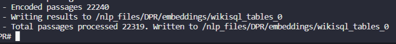

修改 QA:
```
wikisql_test:
  _target_: dpr.data.retriever_data.JsonlWikiSQLQASrc
  file: "/nlp_files/DPR/wikisql_data/test_remove_out200_table_in_total_tables.jsonl"
```
修改 retriever_data.py
```Python
# by Sunlly
class JsonlWikiSQLQASrc(QASrc):
    def __init__(
        self,
        file: str,
        selector: DictConfig = None,
        question_attr: str = "question",
        answers_attr: str = "sql",
        id_attr: str = "table_id",
        special_query_token: str = None,
        query_special_suffix: str = None,
    ):
        super().__init__(file, selector, special_query_token, query_special_suffix)
        self.question_attr = question_attr
        self.answers_attr = answers_attr
        self.id_attr = id_attr

    def load_data(self):
        super().load_data()
        data = []
        with jsonlines.open(self.file, mode="r") as jsonl_reader:
            for jline in jsonl_reader:
                question = jline[self.question_attr]
                answers = jline[self.answers_attr] if self.answers_attr in jline else []
                id = None
                if self.id_attr in jline:
                    id = jline[self.id_attr]
                data.append(QASample(self._process_question(question), id, answers))
        self.data = data
```

期间修改了一下代码，使json不要换行：
```Python
def save_results:
    with open(out_file, "w") as writer:
        ## by Sunlly, for not 换行
        writer.write(json.dumps(merged_data))
        # writer.write(json.dumps(merged_data, indent=4) + "\n")
    logger.info("Saved results * scores  to %s", out_file)
```


得到结果：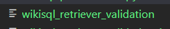

官方没有专门针对 retriever 的评估，自己写了一个评估代码：
/nlp_files/DPR/wikisql_pdr_evaluate.py

结果很不理想，远远没有基线高：

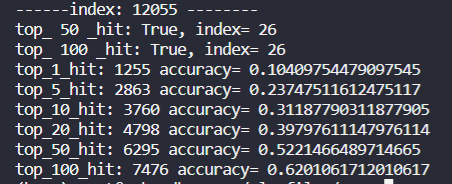

（就像一个学渣平时学的不好，考试前担心自己挂科，拼命复习抱佛脚，结果考完试成绩出来发现果然挂科了的感觉。）

和师姐交流后决定修改 loss，对于20个 other_neg 将原来的 e^{sim(q,p^-)}扩大三倍，差不多相当于60个 other_neg，

```Python
class BiEncoderNllLoss(object):
    def calc:
        scores = self.get_scores(q_vectors, ctx_vectors)
        # by Sunlly to expand the effect of other_neg
        n=scores.shape[1]
        # print(n)
        neg_time_tensor=torch.zeros(1,n)
        for i in range(n):
            if i>=2:
                neg_time_tensor[0][i]=neg_score_times
        neg_time_tensor_gpu=neg_time_tensor.to(device='cuda')
        scores=scores+neg_time_tensor_gpu
        print(scores)
        ##
```

然后将grad_accumulation 设置为32，lr_rate 设置为1e-5，drapout 设置为1.5，重新训练。 尽量向论文的超参数接近。训练的比较慢，由于loss累积， 现在的loss 相当于原来loss 的 loss/32，

增加保存最好检查点：
```Python
## by Sunlly save best checkpoint
def _save_checkpoint(self, scheduler, epoch: int, offset: int, best_checkpoint=False) -> str:
    cfg = self.cfg
    model_to_save = get_model_obj(self.biencoder)
    cp = os.path.join(cfg.output_dir, cfg.checkpoint_file_name + "." + str(epoch))
    ## by Sunlly save best checkpoint
    if best_checkpoint:
        cp = os.path.join(cfg.output_dir, cfg.checkpoint_file_name + "." + str(epoch)+"best")
##

def validate_and_save(self, epoch: int, iteration: int, scheduler):
  if validation_loss<0.5:
      best_cp_name = self._save_checkpoint(scheduler, epoch, iteration,best_checkpoint=True)
      logger.info("Save New Best validation checkpoint %s", best_cp_name)
```

周末跑了两天，没有什么进展。

怀疑可能是表格长度差异太大了，导致模型学习效果不好。

对train 的问题做了筛选，gap=5 取sample，基本保证一个表对应一个问题，然后将设other_neg=60，length=150，过长的给截断，基本能保证各sample 的table 长度一致。

又将loss 给改回来，从ln(3)到ln(1)。

继续训练。这半个月基本可以说是没有进展，心情焦灼，挫败感十足，感觉要 emo了。

**7. 对比 bm25 在 wikisql_tables 集，不用EG（纯 bm25）和用 EG 筛选后的效果**

test集，用纯bm25的检索效果：
bm25_res: k1= 1.2 , b= 0.75 , top_k= 1 ,count= 4595 , hit_accuracy= 0.38113802256138024
bm25_res: k1= 1.2 , b= 0.75 , top_k= 5 ,count= 7300 , hit_accuracy= 0.6055076310550763
bm25_res: k1= 1.2 , b= 0.75 , top_k= 10 ,count= 8279 , hit_accuracy= 0.6867120106171201
bm25_res: k1= 1.2 , b= 0.75 , top_k= 20 ,count= 9225 , hit_accuracy= 0.7651791639017916
bm25_res: k1= 1.2 , b= 0.75 , top_k= 50 ,count= 10404 , hit_accuracy= 0.8629727936297279
bm25_res: k1= 1.2 , b= 0.75 , top_k= 100 ,count= 11235 , hit_accuracy= 0.9319011280690113
bm25_res: k1= 1.2 , b= 0.75 , top_k= 200 ,count= 11788 , hit_accuracy= 0.977770404777704
hit200理论上是应该 100%，但没有达到，是因为排除out_200的问题后又筛选了一遍表格，对结果造成了影响。
不过问题应该不大。后续也不准备再更新表格。

然后选一个在 test 集上效果较好的HydraNet模型，在模型的代码中改成用 cpu 做预测（显存tyh在用）
```Python
class HydraTorch(BaseModel):
    def __init__(self, config):
        self.config = config
        self.model = HydraNet(config)
        if torch.cuda.device_count() > 1:
            self.model = nn.DataParallel(self.model)
        # self.device = torch.device("cuda:0" if torch.cuda.is_available() else "cpu")
        self.device = torch.device("cpu")
```

在 data_preprocess/wikitest_out200.jsonl 上运行：

候选1 /nlp_files/HydraNet-WikiSQL/output/20220630_033334/model_1.pt dev 82.9 ，wikitest_out100.jsonl 83.8
===HydraNet===
sel_acc: 0.976692103516921
agg_acc: 0.9265925680159257
wcn_acc: 0.9774386197743862
wcc_acc: 0.9418546781685467
wco_acc: 0.9716323822163239
wcv_acc: 0.9472461844724619

===HydraNet+EG===
sel_acc: 0.976692103516921
agg_acc: 0.9265925680159257
wcn_acc: 0.9810053085600531
wcc_acc: 0.9703881884538819
wco_acc: 0.9759455872594559
wcv_acc: 0.9732913072329131

无EG:
{
  "ex_accuracy": 0.8809721300597213,
  "lf_accuracy": 0.8340245520902455
}

+EG：
{
  "ex_accuracy": 0.9273390842733908,
  "lf_accuracy": 0.8752488387524884
}
候选2 /nlp_files/HydraNet-WikiSQL/output/20220628_022212/model_2.pt
===HydraNet===
sel_acc: 0.9747013934970139
agg_acc: 0.9197080291970803
wcn_acc: 0.9752820172528202
wcc_acc: 0.9391174518911746
wco_acc: 0.9692269409422694
wcv_acc: 0.9477438619774387

===HydraNet+EG===
sel_acc: 0.9747013934970139
agg_acc: 0.9197080291970803
wcn_acc: 0.9800099535500996
wcc_acc: 0.9698075646980756
wco_acc: 0.9742037159920371
wcv_acc: 0.9724618447246185

无 EG
{
  "ex_accuracy": 0.8779031187790312,
  "lf_accuracy": 0.8283012607830126
}
+EG
{
  "ex_accuracy": 0.9215328467153284,
  "lf_accuracy": 0.8673689449236894
}

落后于 候选1

降低学习率继续训练 hydraNet.候选3：learning_rate	6e-6.无EG，

/nlp_files/HydraNet-WikiSQL/output/20220702_083211/model_2.pt

[wikidev.jsonl, epoch 2] overall:83.5, agg:91.2, sel:97.8, wn:98.7, wc:95.8, op:99.1, val:97.4
[wikitest_out200.jsonl, epoch 2] overall:83.8, agg:92.5, sel:97.6, wn:98.0, wc:94.7, op:99.4, val:96.8

===HydraNet===
sel_acc: 0.9757796947577969
agg_acc: 0.9250995355009953
wcn_acc: 0.9796781685467817
wcc_acc: 0.946914399469144
wco_acc: 0.9732913072329131
wcv_acc: 0.9526376907763769

===HydraNet+EG===
sel_acc: 0.9757796947577969
agg_acc: 0.9250995355009953
wcn_acc: 0.9816688785666888
wcc_acc: 0.9718812209688122
wco_acc: 0.9762773722627737
wcv_acc: 0.9742866622428666

{
  "ex_accuracy": 0.8868613138686131,
  "lf_accuracy": 0.8386695421366954
}

{
  "ex_accuracy": 0.9273390842733908,
  "lf_accuracy": 0.8753317850033179
}

总体来说候选3的效果全胜候选1，是目前效果最好的模型

接下来，用该模型作为检索阶段的 EG 在bm25 算法检索的基础上做评估。

```
cp -r output/20220702_083211 ../hydranet/output
```

修改代码，在bm25 检索出200个 hits 的基础上，用hydranet 转SQL 后执行。计算检索效果的指标.(/nlp_files/hydranet/wikisql_elastic_bm25_and_hydranet_predict_final_tables.py)

res_top_k=[1,5,10,20,50,100]，有EG/无EG。对于有EG ，根据执行结果重新排序hits得到candidate_hits。
```
def rerank_hits(exe_res,hits,k):
将 exe_res=True 的筛选出来作为 candidate_hits，
如果不够 k 个，再按exe_res=False 中 的score 从高到低取，直到满k 个。
```
对于检索出的表 id，分train/dev/test 三种情况在不同的 db 上执行。将检索结果写在test_retrieve_final_table_bm25.jsonl.（用于后续测试end-to-end 的 lf 和 ex）

结果：
3210的时候：
no_EG: num: 3210 ,top_k: 1 count: 1306 accuracy: 0.40685358255451715
no_EG: num: 3210 ,top_k: 5 count: 2008 accuracy: 0.6255451713395639
no_EG: num: 3210 ,top_k: 10 count: 2290 accuracy: 0.7133956386292835
no_EG: num: 3210 ,top_k: 20 count: 2538 accuracy: 0.7906542056074767
no_EG: num: 3210 ,top_k: 50 count: 2834 accuracy: 0.8828660436137071
no_EG: num: 3210 ,top_k: 100 count: 3031 accuracy: 0.9442367601246106

with_WG: num: 3210 ,top_k: 1 count: 1824 accuracy: 0.5682242990654206
with_WG: num: 3210 ,top_k: 5 count: 2574 accuracy: 0.8018691588785046
with_WG: num: 3210 ,top_k: 10 count: 2776 accuracy: 0.864797507788162
with_WG: num: 3210 ,top_k: 20 count: 2922 accuracy: 0.9102803738317757
with_WG: num: 3210 ,top_k: 50 count: 3060 accuracy: 0.9532710280373832
with_WG: num: 3210 ,top_k: 100 count: 3131 accuracy: 0.9753894080996884

可以看出 hit@1 提升 16%，hit@5 提升 18%，hit@10提升 7%，提升幅度较大。

后续再3246个例子的时候出现bug，断掉了。改好 bug 之后接着跑，但是 result 没了。 后面需要倒回来重新跑一下。


前 3246 （0-3245）
no_EG: num: 12056 ,top_k: 1 count: 1317 accuracy: 0.10924021234240212
no_EG: num: 12056 ,top_k: 5 count: 2027 accuracy: 0.1681320504313205
no_EG: num: 12056 ,top_k: 10 count: 2309 accuracy: 0.19152289316522894
no_EG: num: 12056 ,top_k: 20 count: 2559 accuracy: 0.21225945587259457
no_EG: num: 12056 ,top_k: 50 count: 2867 accuracy: 0.23780690112806901
no_EG: num: 12056 ,top_k: 100 count: 3067 accuracy: 0.25439615129396154
with_WG: num: 12056 ,top_k: 1 count: 1843 accuracy: 0.1528699402786994
with_WG: num: 12056 ,top_k: 5 count: 2605 accuracy: 0.21607498341074982
with_WG: num: 12056 ,top_k: 10 count: 2808 accuracy: 0.23291307232913072
with_WG: num: 12056 ,top_k: 20 count: 2955 accuracy: 0.2451061712010617
with_WG: num: 12056 ,top_k: 50 count: 3094 accuracy: 0.256635700066357
with_WG: num: 12056 ,top_k: 100 count: 3167 accuracy: 0.26269077637690774

3246 之后(3246-12056)
no_EG: num: 12056 ,top_k: 1 count: 3278 accuracy: 0.2718978102189781
no_EG: num: 12056 ,top_k: 5 count: 5273 accuracy: 0.4373755806237558
no_EG: num: 12056 ,top_k: 10 count: 5970 accuracy: 0.49518911745189115
no_EG: num: 12056 ,top_k: 20 count: 6666 accuracy: 0.5529197080291971
no_EG: num: 12056 ,top_k: 50 count: 7537 accuracy: 0.6251658925016589
no_EG: num: 12056 ,top_k: 100 count: 8168 accuracy: 0.6775049767750497
with_WG: num: 12056 ,top_k: 1 count: 5040 accuracy: 0.418049104180491
with_WG: num: 12056 ,top_k: 5 count: 7038 accuracy: 0.5837757133377571
with_WG: num: 12056 ,top_k: 10 count: 7584 accuracy: 0.6290643662906437
with_WG: num: 12056 ,top_k: 20 count: 7993 accuracy: 0.6629893828798938
with_WG: num: 12056 ,top_k: 50 count: 8384 accuracy: 0.6954213669542136
with_WG: num: 12056 ,top_k: 100 count: 8515 accuracy: 0.7062873258128732

**总的结果：**

no_EG: num: 12056 ,top_k: 1 count: 4595 accuracy: 0.381138022
no_EG: num: 12056 ,top_k: 5 count: 7300 accuracy: 0.6055076310
no_EG: num: 12056 ,top_k: 10 count: 8279 accuracy: 0.6867120106
no_EG: num: 12056 ,top_k: 20 count: 9225 accuracy: 0.765179163
no_EG: num: 12056 ,top_k: 50 count: 10404 accuracy: 0.8629727936297279
no_EG: num: 12056 ,top_k: 100 count: 11235 accuracy: 0.931901128

with_WG: num: 12056 ,top_k: 1 count: 6883 accuracy: 0.570919044459
with_WG: num: 12056 ,top_k: 5 count: 9643 accuracy: 0.7998506967
with_WG: num: 12056 ,top_k: 10 count: 10392 accuracy: 0.8619774386
with_WG: num: 12056 ,top_k: 20 count: 10948 accuracy: 0.90809555408
with_WG: num: 12056 ,top_k: 50 count: 11478 accuracy: 0.952057067
with_WG: num: 12056 ,top_k: 100 count: 11682 accuracy: 0.968978102


**8.由于dpr 训练效果不好，并且和数据集有很大的关系，准备重新洗一遍wikisql数据集**

创建一个content 由 header

用minhash算法筛除相似度 0.91 以上的表格（wikisql_table_sim.py），剩余 13254 个表（wikisql_tables_process_head_sim_out_0.9.jsonl）


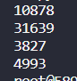


用 筛除了不能执行和执行结果为空的问题集（train/dev/test），筛除表格（wikisql_remove_tables_none_answer.py），剩 12392个表。

用新的表格（wikisql_tables_process_head_sim_out_0.9_without_none_answer.jsonl）
筛除对应的问题集。(wikisql_remove_question_not_in_filted_tables.py)
结果
train 29624
dev 3236
test 5924

共：38784个问题

目前先跑第一版的模型，即没有重新划分数据集和去语境化。

先生成bm25 的数据(/nlp_files/hydranet/table_process_total_process_bm25.py)，并载入 index=wikisql_tables_out_sim.（upload_table_data_test.py）

空间满了，无法创建新的es index，删除了不必要的文件和 git 仓库： rm -rf .git


生成 dpr 的初始数据集，增加分隔符。（table_process_total_process_dpr.py），生成训练和测试所需要的数据que+hard_neg1+neg60

训练，batch_size=2，accumulate__loss=64，other neg=60.max_length=150


效果一般，测试集最高 54%.

去语境化：
1.用具体的名次替换代词/名词短语(he definite NP “the copper statue” with “The Statue of Liberty”, or the abbreviated name “Meg” with “Megan “Meg” Griffin”.) 40%
2.略缩词或名词的扩展
3.删除只能在上下文中才能理解的话语标记（therefore） 3%
4.在名词短语中添加修饰语（in XXX）
5.增加修饰整个句子的短语（at xxx）
6.添加有助于显著提高可读性的背景信息(“The Eagles” with “The American rock band The Eagles.”) 10%

试了一下，手工去语境化太麻烦了，一个下午能处理100个表格就不错了，但一共有10000多张表


自动去语境化（do_decontext_by_auto.py）
将question 和table 的head_conten(page-title+section_title+header)转换成 minhash 向量，对于相似度小于 60% 的question ，增加 “in page_title” 的描述。

同时删除所有的没有 page_title的表格和对应的问题。

共 36243个问题（data_preprocess/train_without_none_answer_0.9_sim_decontext_auto.jsonl）(dev/test)

按 8:1:1.5 的比例划分 train  dev test:[27613,3451,5179](new_ques_id_and_re_divide_dataset.py)

11715张表


重新处理，流程与上面类似，创建新的 dpr 训练数据集

生成 bm25 的时候，去除 page_title，只保留模式信息和content，保证（--）基线的准确率。
index= wikisql-tables_re_divide

结果很理想，用前10000个train 问题和 300个测试集做训练时的评估，效果最高能达到 94.44%
,检索准确率：

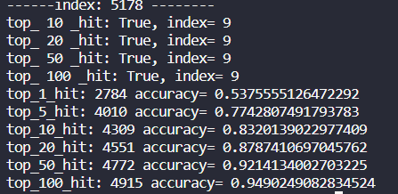

感觉挺高的，继续用全部的训练集做训练（29624），用    cfg.model_file="/nlp_files/DPR/outputs/2022-07-14/08-30-34/test_wikisql_20220714/dpr_biencoder.6" 评估：


接下来用 length=200 做评估， batch_size=30，训练 25轮。

------index: 5178 --------
top_ 1 _hit: True, index= 0
top_ 5 _hit: True, index= 0
top_ 10 _hit: True, index= 0
top_ 20 _hit: True, index= 0
top_ 50 _hit: True, index= 0
top_ 100 _hit: True, index= 0
top_1_hit: 3714 accuracy= 0.7171268584668855
top_5_hit: 4543 accuracy= 0.8771963699555899
top_10_hit: 4709 accuracy= 0.9092488897470554
top_20_hit: 4847 accuracy= 0.9358949604170689
top_50_hit: 4983 accuracy= 0.9621548561498359
top_100_hit: 5067 accuracy= 0.9783742035141919

同时跑bm25，看test 评估的效果

----- 5178 , 2022:07:15 01:42:39 ------------
question: Which city is Naples Airport located in in Blue Air destinations?
 loaded. Data shapes:
input_ids (1166, 96)
input_mask (1166, 96)
segment_ids (1166, 96)
===HydraNet===
model prediction start
model prediction end, time elapse: 6.335601568222046
error_execute_count: 3
before_EG:  hit top_k 5 count: 4
after_EG:  hit top_k 5 count: 4
before_EG:  hit top_k 10 count: 4
after_EG:  hit top_k 10 count: 4
before_EG:  hit top_k 20 count: 4
after_EG:  hit top_k 20 count: 4
before_EG:  hit top_k 50 count: 4
after_EG:  hit top_k 50 count: 4
before_EG:  hit top_k 100 count: 4
after_EG:  hit top_k 100 count: 4
before_EG:  hit top_k 200 count: 4
after_EG:  hit top_k 200 count: 4
***********************************
no_EG: num: 5179 ,top_k: 1 count: 2223 accuracy: 0.42923344274956554
no_EG: num: 5179 ,top_k: 5 count: 3139 accuracy: 0.6061015640084958
no_EG: num: 5179 ,top_k: 10 count: 3456 accuracy: 0.6673102915620777
no_EG: num: 5179 ,top_k: 20 count: 3741 accuracy: 0.7223402201197142
no_EG: num: 5179 ,top_k: 50 count: 4133 accuracy: 0.7980305078200425
no_EG: num: 5179 ,top_k: 100 count: 4432 accuracy: 0.8557636609384051
no_EG: num: 5179 ,top_k: 200 count: 4682 accuracy: 0.9040355280942267
with_WG: num: 5179 ,top_k: 1 count: 2607 accuracy: 0.5033790307009075
with_WG: num: 5179 ,top_k: 5 count: 3512 accuracy: 0.6781231898049817
with_WG: num: 5179 ,top_k: 10 count: 3796 accuracy: 0.732960030893995
with_WG: num: 5179 ,top_k: 20 count: 4017 accuracy: 0.7756323614597412
with_WG: num: 5179 ,top_k: 50 count: 4324 accuracy: 0.8349102143270901
with_WG: num: 5179 ,top_k: 100 count: 4513 accuracy: 0.8714037458968913
with_WG: num: 5179 ,top_k: 200 count: 4682 accuracy: 0.9040355280942267


**9.最后的结果，wikisql_re_divide_0.56**

重新洗了一般 question，sim<=0.56，用训练完的dpr模型评估test：

训练好后：

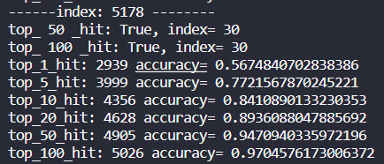

ps: 该图作废，除数少算了1！！！

重新训练的HydraNet模型（0.56）

hydraNet训练后

Model saved in path: output/20220715_065141/model_2.pt
output/20220715_065141_cases
model prediction start
model prediction end, time elapse: 118.74542093276978
wikidev_re_divide_0.56.jsonl: overall:84.3, agg:93.5, sel:98.1, wn:97.8, wc:94.6, op:99.3, val:96.2
model prediction start
model prediction end, time elapse: 179.55445551872253
wikitest_re_divide_0.56.jsonl: overall:83.8, agg:92.9, sel:97.8, wn:97.9, wc:94.7, op:99.5, val:96.0

训练后的hydranet，在 test_re_divide 0.56 上做测评
100%|████████████████████████████████████████████████████████████████████████████████| 5179/5179 [00:31<00:00, 163.73it/s]
{
  "ex_accuracy": 0.8882023556671172,
  "lf_accuracy": 0.8391581386368024
}

bm25

跑加了 title 的效果（未全，到1540 就断了）

no_EG: num: 1540 ,top_k: 1 count: 951 accuracy: 0.6175324675324675
no_EG: num: 1540 ,top_k: 5 count: 1207 accuracy: 0.7837662337662338
no_EG: num: 1540 ,top_k: 10 count: 1287 accuracy: 0.8357142857142857
no_EG: num: 1540 ,top_k: 20 count: 1359 accuracy: 0.8824675324675325
no_EG: num: 1540 ,top_k: 50 count: 1424 accuracy: 0.9246753246753247
no_EG: num: 1540 ,top_k: 100 count: 1468 accuracy: 0.9532467532467532
no_EG: num: 1540 ,top_k: 200 count: 1503 accuracy: 0.9759740259740259
with_WG: num: 1540 ,top_k: 1 count: 1118 accuracy: 0.7259740259740259
with_WG: num: 1540 ,top_k: 5 count: 1350 accuracy: 0.8766233766233766
with_WG: num: 1540 ,top_k: 10 count: 1399 accuracy: 0.9084415584415585
with_WG: num: 1540 ,top_k: 20 count: 1445 accuracy: 0.9383116883116883
with_WG: num: 1540 ,top_k: 50 count: 1475 accuracy: 0.9577922077922078
with_WG: num: 1540 ,top_k: 100 count: 1490 accuracy: 0.9675324675324676
with_WG: num: 1540 ,top_k: 200 count: 1503 accuracy: 0.9759740259740259
比 dpr 高，不太能作为基线

没有加 title 的bm25:


HydraNet+DPR(EG，without EG):

no_EG: num: 5179 ,top_k: 1 count: 2939 accuracy: 0.5673745173745174
no_EG: num: 5179 ,top_k: 5 count: 3999 accuracy: 0.772007722007722
no_EG: num: 5179 ,top_k: 10 count: 4356 accuracy: 0.8409266409266409
no_EG: num: 5179 ,top_k: 20 count: 4628 accuracy: 0.8934362934362934
no_EG: num: 5179 ,top_k: 50 count: 4905 accuracy: 0.946911196911197
no_EG: num: 5179 ,top_k: 100 count: 5026 accuracy: 0.9702702702702702
with_WG: num: 5179 ,top_k: 1 count: 3986 accuracy: 0.7694980694980695
with_WG: num: 5179 ,top_k: 5 count: 4637 accuracy: 0.8951737451737452
with_WG: num: 5179 ,top_k: 10 count: 4819 accuracy: 0.9303088803088803
with_WG: num: 5179 ,top_k: 20 count: 4895 accuracy: 0.944980694980695
with_WG: num: 5179 ,top_k: 50 count: 4988 accuracy: 0.962934362934363
with_WG: num: 5179 ,top_k: 100 count: 5026 accuracy: 0.9702702702702702
