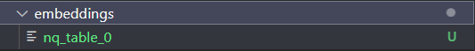

## DPR运行笔记

by Sunlly

2022.6.16

论文：《Dense Passage Retrieval for Open-Domain Question Answering》 2020

github代码：https://github.com/facebookresearch/DPR

---

### 步骤

1. 创建新容器：
```
docker run -itd -m 10g -v [宿主机目录]:[容器目录] --gpus all --name [容器名] --shm-size="2g"  pytorch/pytorch
```
2. 创建目录和git clone项目
```
git clone git@github.com:facebookresearch/DPR.git
cd DPR
```
3. 安装依赖：

```
pip install .
```
4. 运行：
```
python train_dense_encoder.py \
train_datasets=[list of train datasets, comma separated without spaces] \
dev_datasets=[list of dev datasets, comma separated without spaces] \
train=biencoder_local \
output_dir={path to checkpoints dir}
```
使用 nq 的数据集作为测试：

```
python train_dense_encoder.py \
train_datasets=nq-train.json \
dev_datasets=nq-dev.json \
train=biencoder_local \
output_dir=test_nq_20220616
```

修改 train_dense_encoder.py 的 args 后可以直接运行和调试。

### 问题

1. 运行 train_dense_encoder.py

报错：OSError: [E050] Can't find model 'en_core_web_sm'. It doesn't seem to be a Python package or a valid path to a data directory.

原因：包下载有问题

解决： 尝试 python -m spacy download en_core_web_sm 无效；

下载：https://github.com/explosion/spacy-models/releases/download/en_core_web_sm-3.3.0/en_core_web_sm-3.3.0-py3-none-any.whl

安装：pip install en_core_web_sm-3.3.0-py3-none-any.whl

安装成功

### 处理记录

**1. 将 wikisql 训练集、测试集做处理，训练 DPR**

处理数据集，将 前面筛除过的 test 集 中的table，出现过的table 保留，没有出现过的table删除(wikisql_remove_tables_out100.py)，形成新的 test.tables.jsonl(test.tables_remove_out100.jsonl)

test.tables.jsonl
total: 5230个表
count: 4628
remove: 602

修改 wikisql_generatedata 的代码，用 WikiSQL 生成符合 dpr 训练数据形式的数据集，格式如下：
```
[
    {
        "dataset": "nq_dev_psgs_w100",
        "question": "who sings does he love me with reba",
        "answers": [
            "Linda Davis"
        ],
        "positive_ctxs": [
            {
                "title": "Does He Love You",
                "text": "Does He Love You \"Does He Love You\" is a song written by Sandy Knox and Billy Stritch, and recorded as a duet by American country music artists Reba McEntire and Linda Davis. ",
                "score": 13.394315,
                "title_score": 0,
                "passage_id": "11828866"
            },
            {
                "title": "Red Sandy Spika dress of Reba McEntire",
                "text": "Red Sandy Spika dress of Reba McEntire American recording artist Reba McEntire wore a sheer red dress to the 1993 Country Music Association Awards ceremony on September 29, 1993.",
                "score": 12.924647,
                "title_score": 0,
                "passage_id": "15632586"
            }
        ],
        "negative_ctxs": [
            {
                "title": "Cormac McCarthy",
                "text": "chores of the house, Lee was asked by Cormac to also get a day job so he could focus on his novel writing. ",
                "score": 0,
                "title_score": 0,
                "passage_id": "2145653"
            },
            {
                "title": "Pragmatic Sanction of 1549",
                "text": "one heir, Charles effectively united the Netherlands as one entity. ",
                "score": 0,
                "title_score": 0,
                "passage_id": "2271902"
            }
          ]
        },
        {
          "dataset": "nq_dev_psgs_w100",
          "question": "who sings does he love me with reba",
          "answers": [
              "Linda Davis"
          ],
          ...
        }
]
```

根据代码的 github 网站上所述，其实score 是没有在模型中用到的，但是包含在了数据集内。

** 不确定bm25的负样本是如何融入到模型的训练中去的

写了一个处理数据集的代码，将原数据集/筛选过后的数据集修改成DPR 的输入数据集：(data_generate_dpr.py),自己定义了标签名：

```python
neg_tables=[]
for i in range(neg_num):
    random_idx=random.randint(1,len(tables_ids))-1
    # print("random_idx:",random_idx)
    random_table_id=tables_ids[random_idx]

    while random_table_id == origin_table_id:
        random_idx=random.randint(1,len(tables_ids))-1
        random_table_id=tables_ids[random_idx]

    random_table_content=tables[random_table_id]

    neg_sample={}
    neg_sample["table_id"]=random_table_id
    neg_sample["content"]=random_table_content
    neg_tables.append(neg_sample)


item_out={}
item_out["dataset"]="wikisql_"+phase
item_out["question"]=raw_sample['question']
item_out["answer"]=[raw_sample["sql"]]
item_out["positive_ctxs"]=[pos_sample]
item_out["negative_ctxs"]=neg_tables

item_out=json.dumps(item_out)
f.write(item_out)
```

对于 negative_ctxs，在 table 中随机取 20 个，对应训练时的 batch

**（但是不太清楚dpr 原代码的实现中是如论文所说的 in-batch 的训练，即负样本取自 数据集中的 negative_ctxs ，还是同 batch ）

修改dpr 原代码中，标签名载入部分的代码：
```python
class JsonQADataset(Dataset):
...
  def create_passage(ctx: dict):
      return BiEncoderPassage(
          ## 改标签名 by Sunlly
          # normalize_passage(ctx["text"]) if self.normalize else ctx["text"],
          # ctx["title"],
          normalize_passage(ctx["content"]) if self.normalize else ctx["content"],
          ctx["table_id"],
      )
```

运行 train_dense_encoder.py 开始训练模型

问题：
由于table的 token 过长，输出警告：意思是会将超过的 table token截去，只保留前面的

**（论文上也提到了这一点，将 过长的 passage 分成多段，并且训练样本 passage 的长度最好一样）
```
Be aware, overflowing tokens are not returned for the setting you have chosen, i.e. sequence pairs with the 'longest_first' truncation strategy. So the returned list will always be empty even if some tokens have been removed.

```

解决：加入头文件
```
import transformers
transformers.logging.set_verbosity_error()
```
其含义：只报告错误信息，将详细程度设置为ERROR级别。

** 但是，截取表格后，表格内容信息不完整，会不会影响表格性能？（希望模型能学习到如果 question 和内容有token 相同，他们的相似度会更高 这一点）

** 技巧：dpr 通过log 打印了输出日志，效果比 nohup 的好，后续可以学一下。

在wikisql上训练后，用 test 做评估，结果不太理想：

仅在 test 的 pos/neg 样本上做测试，
correct prediction ratio  4541/13216 ~  0.343599

**2. 下载官方的模型检查点，生成 embeddings（将 passage 编码为向量形式）**

由于上面的模型效果不好，决定先用官方训练好的模型先把代码跑通。

下载官方检查点：

```Python
  "checkpoint.retriever.single.nq.bert-base-encoder": {
      "s3_url": "https://dl.fbaipublicfiles.com/dpr/checkpoint/retriever/single/nq/hf_bert_base.cp",
      "original_ext": ".cp",
      "compressed": False,
      "desc": "Biencoder weights trained on NQ data and HF bert-base-uncased model",
  },
```

修改 generate_dense_embeddings.py 中的配置参数：

```Python
def main(cfg: DictConfig):

    ## add args by Sunlly
    # cfg.model_file="/nlp_files/DPR/outputs/2022-06-16/08-59-29/test_nq_20220616/dpr_biencoder.3"
    cfg.model_file="/nlp_files/DPR/model/hf_bert_base.cp"
    # cfg.ctx_src="/nlp_files/DPR/nq-dev-small.json"
    # cfg.ctx_src="/nlp_files/DPR/downloads/data/wikipedia_split/psgs_w100.tsv"
    cfg.ctx_src="dpr_wiki"
    cfg.out_file="/nlp_files/DPR/embeddings/nq"
```

修改 default_dources.yml:

```
dpr_wiki:
  _target_: dpr.data.retriever_data.CsvCtxSrc
  # file: data.wikipedia_split.psgs_w100
  file: "/nlp_files/DPR/downloads/data/wikipedia_split/psgs_w100.tsv"
  id_prefix: 'wiki:'

dpr_nq:
## 用于编码的text 形式
  _target_: dpr.data.retriever_data.CsvQASrc
  # file: /nlp_files/DPR/nq-dev-small.json
  file: /nlp_files/DPR/nq-test.csv
  # id_prefix: 'nq-small:'
```
注意： cfg.ctx_src 不能直接指定路径，需要在 default_dources.yml 中去找。如果是 dpr_wiki 并指定 `file: data.wikipedia_split.psgs_w100` 会自动下载 psgs_w100.tsv（12G）。没有用 nq 的数据集，此处相当于先用官网的例子跑通。

tsv 文件例子：


**后续可以按照 tsv 的格式构建 tables 的数据集。

修改了 gen_embs.yaml，用处不大。

修改了原代码中的 end_idx：
```Python
# end_idx = start_idx + shard_size
end_idx=start_idx +200
```
因为只想跑个例子，原数据集的 passage 太多了。所以相当于只取了前 200条生成 ctx 向量。

开始跑代码：
```
python generate_dense_embeddings.py
```

生成的向量结果在 embeddings 中，是个打不开的二进制文件


**3. 根据生成好了的 ctx 向量，编码问题做检索**

代码在 dense_retriever.py。

修改配置：

```Python
@hydra.main(config_path="conf", config_name="dense_retriever")
def main(cfg: DictConfig):
    cfg = setup_cfg_gpu(cfg)

## add args by Sunlly
    cfg.model_file="/nlp_files/DPR/model/hf_bert_base.cp"
    cfg.qa_dataset="nq_test"  #/nlp_files/DPR/conf/datasets/retriever_default.yaml
    cfg.ctx_datatsets=["dpr_wiki"] ## need [] is a dict
    cfg.encoded_ctx_files=["/nlp_files/DPR/embeddings/nq_0"] ## need [] is a dict
    cfg.out_file="/nlp_files/DPR/retriever_validation"
```

retriever_default.yaml:
```
nq_test:
  _target_: dpr.data.retriever_data.CsvQASrc
  # file: data.retriever.qas.nq-test
  file: "/nlp_files/DPR/nq-test.csv"
```

遇到问题：

IndexError: Dimension out of range (expected to be in range of [-1, 0], but got 1)

解决：按：https://github.com/facebookresearch/DPR/issues/213

修改代码：顺利解决

```Python
# max_vector_len = max(q_t.size(1) for q_t in batch_tensors)
# min_vector_len = min(q_t.size(1) for q_t in batch_tensors)
max_vector_len = max(q_t.size(0) for q_t in batch_tensors)
min_vector_len = min(q_t.size(0) for q_t in batch_tensors)
```

run code:


```
python dense_retriever.py
```
结果：


找到了前 100 个匹配的 passage，由于数据集和 question 其实是对不上的，所以无法评估正确率。

检索的参数具备 score，可以用于后续的 rerank。

可以在 dense_retriever.yml 中设置检索的 passage 数量：


###  运行 NQ-table retrieval

**1. 下载 nq-table 模型检查点，根据生成好了的 ctx 向量，编码 nq-table**


nq_table 数据集 tables 部分示例：

```json
{
    "columns": [{
        "text": ""
    }, {
        "text": ""
    }, {
        "text": "Born"
    }, {
        "text": "Residence"
    }, {
        "text": "Occupation"
    }, {
        "text": "Years\u00a0active"
    }, {
        "text": "Height"
    }, {
        "text": "Television"
    }, {
        "text": "Children"
    }],
    "rows": [{
        "cells": [{
            "text": "Lesley Joseph"
        }, {
            "text": "Joseph in Cardiff, Wales, May 2011"
        }, {
            "text": "Lesley Diana Joseph  14 October 1945 (age\u00a072) Finsbury Park, Haringey, London, England"
        }, {
            "text": "Hampstead, North London"
        }, {
            "text": "Broadcaster, actress"
        }, {
            "text": "1969\u2013present"
        }, {
            "text": "5\u00a0ft 2\u00a0in (1.57\u00a0m)"
        }, {
            "text": "Birds of a Feather"
        }, {
            "text": "2"
        }]
    }],
    "tableId": "Lesley Joseph_A1D55A57012E3362",
    "documentTitle": "Lesley Joseph",
    "documentUrl": "https://en.wikipedia.org//w/index.php?title=Lesley_Joseph&amp;oldid=843506707"
}
```

取 100 个 table 作为示例：修改 conf/ctx_sources/table_sources.yaml:
```
nq_table_raw:
  _target_: dpr.data.retriever_data.JsonlNQTablesCtxSrc
  # file: "/mnt/zhiruow/hitab/table-retrieval/datasets/nq_table/tables.jsonl"
  file: "/nlp_files/nqt-retrieval/datasets/nq_table/tables_small.jsonl"
  id_prefix: 'nqt:'
```
修改 generate_embedding.py 的参数配置：

```Python
def main(cfg: DictConfig):
    ## by Sunlly
    cfg.model_file="/nlp_files/nqt-retrieval/checkpoint/retriever/single-adv-hn/nq/bert-base-encoder.cp"
    cfg.ctx_src="nq_table_raw"
    cfg.out_file="/nlp_files/nqt-retrieval/embeddings/nq_table"
```

run code:
```
python generate_embedding.py
```

问题：
```
  ctx_src = hydra.utils.instantiate(cfg.ctx_sources[cfg.ctx_src])
```
报错， 经过检查后 ctx_src 是正确的。

解决：注释：
```Python
from dpr.data.biencoder_data import (
    BiEncoderTable,
    get_nq_table_files,
    get_processed_table,
    # get_processed_table_wiki,
    # get_processed_table_wqt,
)
```
问题：

报错：
```
if self.id_prefix: sample_id = self.id_prefix + sample['id']
```
sample not has 'id'
解决：
换 ctx_scr , 从 nq_table 到 nq_table_raw

问题：
biencoder_data.py
```
if max_cell_num: cell_list = cell_list[: max_cell_num]
```
发生异常: TypeError
slice indices must be integers or None or have an __index__ method

处理第一个表就报错。

解决：注释该句

问题：

table_data.py 中报错：
```python
for cell in cell_list:
    text = cell['text'].strip()
```
TypeError:
tuple indices must be integers or slices, not str

解决： 换成引用而不是切片

```Python
for cell in cell_list:
    # text = cell['text'].strip()
    text = cell.text.strip()
```

不知道为啥会有这个问题，可能是 python  版本不一样的原因。
下面又遇到错误，同样替换。
```Python
# row_ids.extend([cell['row_idx'] for _ in cell_token_ids])
# col_ids.extend([cell['col_idx'] for _ in cell_token_ids])
row_ids.extend([cell.row_idx for _ in cell_token_ids])
col_ids.extend([cell.col_idx for _ in cell_token_ids])
```

前 100 个 tables 处理完成：





另外，运行 process_table.py 可以处理表格，比如增加分隔符之类的。

**2. 基于 nq-table 的编码做检索**

从 nq_table_test 中取了 6 个问题做测试（nq_table_test_small.jsonl），其中最后一个比较长。

run code :
```
python dense_retrieval.py
```

也遇到同上问题（cell[...]），同理修改解决。

结果：（nq_table_test_small_result.jsonl）

```
{
    "question": "where does the brazos river start and stop",
    "answers": [
        "Llano Estacado",
        "Gulf of Mexico"
    ],
    "ctxs": [
        {
            "id": "nqt:Amazon River_4E0AC7C7AE20D8EE",
            "title": "amazon river",
            "text": "amazon river name | country | coordinates | image | hidenotes . allpahuayo - mishana national reserve | peru | 3 \u00b0 56\u2032s 73 \u00b0 33\u2032w\ufeff / \ufeff3.933 | [ 51 ] . amacayacu national park | colombia | 3 \u00b0 29\u2032s 72 \u00b0 12\u2032w\ufeff / \ufeff3.483 | [ 52 ] . amazo\u0302nia national park | brazil | 4 \u00b0 26\u2032s 56 \u00b0 50\u2032w\ufeff / \ufeff4.433 | [ 53 ] . anavilhanas national park | brazil | 2 \u00b0 23\u2032s 60 \u00b0 55\u2032w\ufeff / \ufeff2.383 | [ 54 ] .",
            "score": "65.01775",
            "has_answer": false
        },
        {
            "id": "nqt:Assiniboine River_75DCC362724ADC33",
            "title": "assiniboine river",
            "text": "assiniboine river location | peak flow , 1995 ( m3 / s ) | mean flow , april ' 95 ( m3 / s ) | mean flow , may ' 95 ( m3 / s ) | max flow , date ( m3 / s ) . russell | 360 may 4 | 34.2 | 46.3 | 504 april 29 , 1922 . brandon | 566 april 26 | 81.1 | 104.0 | 651 may 7 , 1923 . headingley | 300 april 20 | 115.0 | 142.0 | 614 april 27 , 1916 .",
            "score": "64.74672",
            "has_answer": false
        },
        {
            "id": "nqt:Indus River_78C7B2189DD8401",
            "title": "indus river",
            "text": "indus river [ show ] v t e hydrology of pakistan | [ show ] v t e hydrology of pakistan.1 . lakes | ansoo baghsar banjosa borith chitta katha dudipatsar hadero . rivers | indus astore bara basol braldu bunhar chenab dasht . coastal | indian ocean arabian sea gulf of oman . categories | lakes rivers .",
            "score": "60.91795",
            "has_answer": false
        },
        ...
```

由于只取了200 个表格，虽然检索出来的表格可能对不上，但是总体而言内容还是比较相关。

**3. 完整的 nq-table 数据集做编码和检索**

修改：conf/ctx_sources/table_sources.yaml 中的 file 为完整的 nq_table：

```
nq_table_raw:
  _target_: dpr.data.retriever_data.JsonlNQTablesCtxSrc
  # file: "/mnt/zhiruow/hitab/table-retrieval/datasets/nq_table/tables.jsonl"
  file: "/nlp_files/nqt-retrieval/datasets/nq_table/tables.jsonl"
  id_prefix: 'nqt:'
```

修改 generate_embeddings.py 中的 out_file,
```Python
cfg.model_file="/nlp_files/nqt-retrieval/checkpoint/retriever/single-adv-hn/nq/bert-base-encoder.cp"
cfg.ctx_src="nq_table_raw"
cfg.out_file="/nlp_files/nqt-retrieval/embeddings/nq_table"
```
运行：

```
nohup python \-u generate_embeddings.py
````

nq_table：共 168989 个表格，编码约用3.5 h。（近17万个表）

**4. 如何将 wikisql_table 以平铺或 加分隔符的方式，载入 dpr embedding?**

对wikisql 中 train/dev/test 中所有的表综合在一起，构建一个 wikisql_tables 集。

1. 剔除执行结果为空的 train/dev/test 的 question

|        | question | remove_none_answer |
| ------ | -------- | ------------------ |
| train  | 56355    | 52032              |
| dev    | 8421     | 7764               |
| test   | 15878    | 14599              |


2. 将原始的各tables文件（WikiSQL/data/train.tables.jsonl、dev.tables.jsonl、test.jsonl）全部合起来，形成wikisql_tables_process_bm25.jsonl。

bm25 的数据集处理过程如下：(table_process_process_bm25.py)

for  循环读取三个 pharse（）拼接 page_title(如果有) /header/ rows，增加 column 项。为了便于后续的区分，为id 增加前缀：train_/dev_/test_

然后全部合起来，形成总的 wikisql_tables 集（wikisql_tables_process_bm25.jsonl）

|        | origin_table_num |
| ------ | ---------------- |
| train  | 18585            |
| dev    | 2716             |
| test   | 5230             |
| total: | 26531            |

 全部导入 elasticsearch 中的 index=wikisql_tables(upload_table_data_test.py),结果：

 ```
 {'count': 26531, '_shards': {'total': 1, 'successful': 1, 'skipped': 0, 'failed': 0}}
 ```
 导入成功。

 3. 基于剔除执行结果为空的 train/dev/test 的 question， 剔除三个数据集中 bm25 top100(数字值得商榷)的question 和table。

修改 wikisql_elastic_python_test_remove_out100_tables.py
,**top_k 设置成 200**，bm25 为默认参数值，增加 phase 并运行（hisresult 增加 phase），结果：

train: 筛除 8698 个


dev:筛除 1406个问题


test:筛除 2543个问题


 |         | remove_none_answer | remove_bm25_out_ |
 | ------ | ------------------ | ---- |
 | train   | 52032              | 43334 |
 | dev        | 7764               | 6358 |
 | test      | 14599              | 12056 |


作为最后的 open_wikisql_question 集

去除筛选后保留的问题中没有包含到的表格 （wikisql_remove_tables_out200.py）


最后保留下来的表格有 22319 个，共移除 4212个。

 4. 创建 dpr 的表格数据。分两种情况：直接平铺和有分隔符。

table_process_total_process_dpr.py

修改：实现生成两种情况的table数据集
```
has_delimiters=True
```


26531 个表格-->22319个表格

同上面一样的方法筛除 table：


5. 生成 dpr 的 wikisql  训练数据形式的数据集

采用的策略是，neg:随机取60个 table，soft_hard_neg:检索 bm25 ，在top20 中随机取3个，pos:只有1个。 
