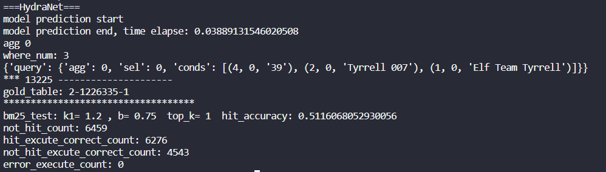

## HydraNet 处理记录

by Sunlly
2022.6.8

论文：《Hybrid Ranking Network for Text-to-SQL》 2020

github代码：https://github.com/lyuqin/HydraNet-WikiSQL

---

### 1. 训练模型

1. 根据运行笔记训练HydraNet模型

2. 结果：达不到论文的准确度，但经过筛选，得到只比论文结果低0.2个点的模型

config：bert-large:
跑了 4 个epoch :
wikidev.jsonl: overall:83.3, agg:91.0, sel:97.6, wn:98.5, wc:95.3, op:99.1, val:97.5
wikitest.jsonl: overall:83.2, agg:91.3, sel:97.4, wn:98.1, wc:94.8, op:99.1, val:97.4

论文结果：
dev 83.5, test 83.4

### 2.以前1000个question为例，比较随机打乱表格顺序后的模型预测结果

1. 修改wikisql_gendata.py，仅改了 dataset 中的 column_meta，得到一个问题-random table 的 test集。

2. 运行wikisql_prediction_test_top1000.py（经过修改），对比。

+ 问题1：base_model.py 中，predict_SQL->parse_output->get_span 函数报错：
  out of index。

  跟踪：where condition 预测的 span 超过原问题的长度。只有在 random_table 的数据集上会遇到，原 test 数据集没有遇到。

  解决：对于 get_span 中出错的情况，将返回的 span 直接设置为（0,0）(即没有where 条件)，
  ```
  ## for random dataset, when i>len(segment_ids), error occurs
  if i>len(input_feature.segment_ids)-1:
      return (0,0)
  ```
  parse_output 中对于 vs 和 ve 的 out of index，设置跳过和返回：
  ```
  _, op, vs, ve = conditions[wc]
  ## out of index error:
  if wc>len(input_feature.subword_to_word)-1:
      continue

  if vs>len(input_feature.subword_to_word[wc])-1 or ve>len(input_feature.subword_to_word[wc])-1:
      vs=0
      ve=0
  ```

+ 问题2：base_model.py 中，predict_SQL_with_EG->beam_parse_output->get_span 函数报错：
    out of index。

    由于 返回的 spans 多了一个 sum_logp 参数（不太理解其含义），暂时没有找到一个很好的解决方法。


没有 with_EG 的测试结果：

| origin table   | random_table   |
| -------------- | -------------- |
| sel_acc: 0.934 | sel_acc: 0.934 |
| agg_acc: 0.911 | agg_acc: 0.911 |
| wcn_acc: 0.979 | wcn_acc: 0.893 |
| wcc_acc: 0.918 | wcc_acc: 0.836 |
| wco_acc: 0.976 | wco_acc: 0.89  |
| wcv_acc: 0.938 | wcv_acc: 0.353 |

分析：对于全局的的预测，比如 agg、selnum和wcnum，应该准确率比较高；
从结果对比上看，sel的准确度很高，想不明白？
wcv的准确率很低，可以理解，因为预测的 span 真的不准，有些还超过了 question 的index， 都用（0,0） 代替了，间接导致了 wcn 等的不准确。

分析了一波原因，可能是因为预测的时候只用了列的序号，而没有用列名导致的。在 random_table的setting 中，即使列序号一样，预测出来的SQL 也大概率是不同的。对于 origin table 则不存在这个问题（列号相同，生成的SQL 肯定就对；不同，生成的SQL 肯定不对，因为table是定死了的。）

因此后续考虑在评估的时候，对列名是否相同而计算准确度，而不是列的序号是否相同。

3. 修改wikisql_gendata.py 代码，生成既包含 origin_column 又包含 random_column的 数据集，并且修prediction的代码。

在wikisql_gendata.py 保存 jsonl 的时候，增加origin 的各数据项（origin_table_id,origin_column_meta).

char_to_word：每个 char 在第几个单词中, word_to_char_start：每个单词的开始对应第几个 char，由 tokenizer生成

  修改 wikisql_prediction.py, base_model.py -> print_metric，增加 random_table_file 参数，从 origin_column_meta 、random_column_meta 中提取列名，以str的相等（以前是 列序号相等）作为 acc 的计算条件。

```python
def sel_match_with_column_name(s,r,o, p):
# for s,r,o, p in sp:
    ## 可能预测的列序号超过了表格原长（无法得到列名），此时直接返回 false
    if int(p["sel"])>len(r)-1:
        return False
    return str(r[int(p["sel"])][0]).lower() == str(o[int(s["sel"])][0]).lower()

def wcc_match(a,r,o, b):
    a = sorted(a, key=lambda k: k[0])
    b = sorted(b, key=lambda k: k[0])
    # return [c[0] for c in a] == [c[0] for c in b]
    return [str(r[int(c[0])]).lower() for c in a] == [str(o[int(c[0])]).lower() for c in b]
```
  对于random_table，准确度有明显下降,对于 origin_table，性能不变。
  + origin_table:
  
  + randowm_table:
  

4. 修改wikisql_evaluate.py 代码，以最后的 SQL 准确度（可以不要求精确的 where condition order）作为 lf_acc , 以执行结果作为 ex_acc

目前 lf 和 ex 的计算均在原表进行，用的列序号：
+ origin_table:

+ random_table:


对于 random_table 来说，准确度是虚高的。基本相当于只有 where condition value 和原来不同。

修改wikisql_evaluate.py，将命令行执行修改成预设文件路径：
```python
# parser = ArgumentParser()
    # parser.add_argument('source_file', help='source file for the prediction')
    # parser.add_argument('db_file', help='source database for the prediction')
    # parser.add_argument('pred_file', help='predictions by the model')
    # parser.add_argument('--ordered', action='store_true', help='whether the exact match should consider the order of conditions')
    # args = parser.parse_args()

    source_file=os.path.join("data_preprocess", "test_1000.jsonl")
    pred_file="output/test_out_top1000.jsonl"
    db_file="WikiSQL/data/test.db"
    random_table_file = os.path.join("data_preprocess", "wikitest_top1000_random.jsonl")
    ordered=False
  ```

增加 random_table 读取；
```python
with open(source_file) as fs, open(pred_file) as fp, open(random_table_file) as fr:
       grades = []
       error_execute_count=0
       ## ls: source_file, lp: pred_file,eg，qg:原版，ep:预测
       for ls, lp ,lr in tqdm(zip(fs, fp, fr), total=count_lines(source_file)):
         eg = json.loads(ls)
         ep = json.loads(lp)
         er =json.loads(lr)
```
修改 query.py，增加 convert_col_index_to_name 方法，保存一个字典 self.col_index_to_name，能将 index 映射成 name。
修改 相等判断条件：从列序号映射成为列名再进行比较：
```python
def __eq__(self, other):
        if isinstance(other, self.__class__):
            ## 新增：将列序号转换为列名
            if len(self.col_index_to_name)>0 and len(other.col_index_to_name)>0:
                indices = str(self.col_index_to_name[self.sel_index]).lower() == str(other.col_index_to_name[other.sel_index]).lower() and self.agg_index == other.agg_index
                if other.ordered:
                    conds = [(str(self.col_index_to_name[col]).lower(), op, str(cond).lower()) for col, op, cond in self.conditions] == [(str(other.col_index_to_name[col]).lower(), op, str(cond).lower()) for col, op, cond in other.conditions]
                else:
                    conds = set([(str(self.col_index_to_name[col]).lower(), op, str(cond).lower()) for col, op, cond in self.conditions]) == set([(str(other.col_index_to_name[col]).lower(), op, str(cond).lower()) for col, op, cond in other.conditions])
            ###
            ## 原代码
            else:
                indices = self.sel_index == other.sel_index and self.agg_index == other.agg_index
                if other.ordered:
                    conds = [(col, op, str(cond).lower()) for col, op, cond in self.conditions] == [(col, op, str(cond).lower()) for col, op, cond in other.conditions]
                else:
                    conds = set([(col, op, str(cond).lower()) for col, op, cond in self.conditions]) == set([(col, op, str(cond).lower()) for col, op, cond in other.conditions])
            return indices and conds
        return NotImplemented
```
修改后，lf 准确度 是实际 SQL 的准确度。

虽然 excute 的代码没有修改，但表的 id 修改后，from ... col_name 也应该是跟着变了，取得random_table 上相应的列。

在 random_table 的生成结果的表格上，有242/1000 个问题无法执行。执行准确度不出意外的低，为0.005。origin_table 的结果不变。

random_table:


origin_table:


### 3.处理数据集：对于test集，删除执行无答案的例子，和bm25找表gold truth 的表在100个以外的例子

+ 删除执行无结果的 question 例子

  本来想试试用 tapas 的处理数据集的代码（能得到答案坐标，然后找结果），但是效果不理想，舍弃的question 过多，怀疑代码哪里有误。

  后来用的HydraNet中的 DB.engine 执行来得到结果，将执行 error 和结果为 [None] 的例子舍弃。(data_process_by_dbengine.py)结果如下：

  train:56355-->52032
  test:15878-->14599(test_without_none_answer.jsonl)
  dev:8421-->7764

  结果总体而言比较合理

+ 删除bm25 top100 还没找到 gold 的 table 的question

  处理 test.tables.jsonl：加入 "meta_data"一项，方便检索的后续预测；并且将"page_title" 项加入 "content",提升了检索效果 （table_process_test.py）

  将处理后的数据导入 index（upload_table_data_test.py）

  通过检索得到检索的结果:hit or not hit，来对question 做删除。bm25 算法使用默认值（k1=1.2,b=0.75)（wikisql_elastic_python_test_remove_out100_tables.py）结果如下：

  test：14599--> 13225(test_remove_out100_table.jsonl)
  筛除了1374个例子，原本 0.906的top100准确率变为100%。表明结果合理。

### 4. 基于bm25 的 Retrieve-predict-excute 实现：用bm25 找分数最高的表，并做预测，看 retrive_acc/ex_acc

以top_k=1 为例，预测的 retrive_acc:
bm25_test: k1= 1.2 , b= 0.75  top_k= 1  hit_accuracy: 0.5116068052930056(wikisql_elastic_bm25_and_hydranet_predict.py)

设计了以下函数，得到模型预测的sql 和最终的执行结果：
```python
examples=get_examples(question,hits)
sql=predict_by_hydranet(examples)
res=excute_sql(sql,hit_table,hit_column_meta)
```

将执行结果和表格 hit 的结果做一个统计和对比。看一看 res 和 hit_excute 的结果是否差距较大，是否可以用执行结果来对找表的准确情况做评估。
```python
print("***",num,"---------------------")
if hitResult:
   print("gold_table:",ground_truth_table)
   if res==True:
       hit_excute_correct_count=hit_excute_correct_count+1
   count = count + 1
else:
   print("gold_table:",ground_truth_table)
   print("hit_table:",hit_table)
   if res==False:
       not_hit_excute_correct_count= not_hit_excute_correct_count+1
   not_hit_count= not_hit_count+1
```

结果如下，对于 hit 的情况，excute_correct是指：结果不为空/执行无错误/预测的col在表范围内；

对于not_hit 即选错表了的情况，excute_correct是指：执行错（比较典型的是数据类型和操作符不匹配）、结果为空、预测的col 超过表的范围。


|         | count | excute_correct_count |
| ------- | ----- | -------------------- |
| hit     | 6766  | 6276                 |
| not_hit | 6459  | 4543                 |

从结果中可以看到，对于hit 的情况， excute_correct_count还是比较高，比例占总数的92.76%，符合我们的预期。中间有一定的差距，个人觉得是来源于模型本身的误差。同时 EG 对模型的提升也挺大。

对于 not_hit 的情况，excute_correct_count/count=70.336%，还是算比较高的，但是没有达到预期（预期 90% 以上）分析原因如下：

1. 执行的时候取的列序号（对于SQL的相等判断来说，不能取列序号，但是对于执行，取列名+random_table 和取列序号的结果是一样的），此时，对于不涉及到where的执行（random_table 中，where_num=0的概率很高），则不会产生执行错误。

2. 对于问题的聚合符是 count 的问题来说，也不容易产生执行错误。

3. 模型本身也会带来一定的误差

那么，EG 对于检索的提升效果到底能不能达到实用呢？我们估算一下，

一个表如果 执行 correct为False，则是 random_table 的概率约为：0.7 * 0.5 /(0.7*0.5+0.08 * 0.5)= 90% （贝叶斯公式活学活用），概率还是非常高的。

一个表如果 执行 correct 为True，则是random_table的概率为（0.3 * 0.5) /(0.3 * 0.5 +0.5 * 0.92)=24% ，概率比较低但是有一定概率。

用False 的执行结果来作为重要的候选 rerank 分数项还是基本比较合理的。

*
修改了判断错误的条件，取消了col 超过表格范围（认为包含在 error 中），同时补充了 len(pred)==0 和 pred[0]==None 并列；
结果：

|         | count | excute_correct_count |
| ------- | ----- | -------------------- |
| hit     | 6766  | 6217                 |
| not_hit | 6459  | 4837                 |

excute_error_count:hit(549),not_hit(1622)2171
74.942422%的执行出错的表是检索错误的表。 

not_hit 的 correct 增长了许多，excute_correct_count/count =74.89%

### 5. 基于bm25 的 Retrieve-predict-excute top5 实现：用bm25 找分数最高的前 100 个表，并做预测，将 res中的False 情况去掉，取前 top5,看 retrive_acc

|         | count |
| ------- | ----- |
| hit     | 12441 |
| not_hit | 784   |
| total   | 13225 |

top5_retrive_acc=12441/13225=94.07%

准确率有了大幅提升，说明执行引导的方法有效
