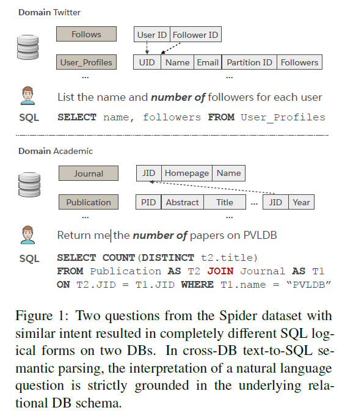
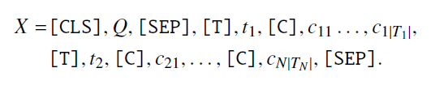
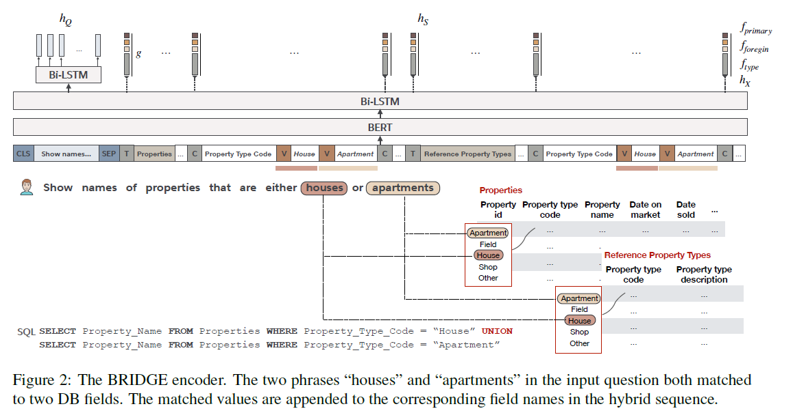

##BRIDGE阅读笔记

论文：《Bridging Textual and Tabular Data for
Cross-Domain Text-to-SQL Semantic Parsing》

作者Xi Lin等
2020,EMNLP

论文创新性地提出了：

+ **BRIDGE：**一个自然语言（NL）到关系型数据库的跨DB语义解析器。以序列（tagged sequence）表示NL问题和数据库模式（DB schema），用字段的子集用问题中涉及的单元格值来增强序列。混合序列用BERT进行编码，带最小的后续层，以深度注意的BERT微调实现text2DB的上下文化。
+ BRIDGE用隐藏状态的相关的token，表示模式组件（table和field）。为对齐模式和问题，利用了_锚文本（anchor texts）_，自动提取和问题相关的单元格值。
+ 结合了指针生成decoder和模式一致性搜索空间剪枝（Combined with a pointer-generator decoder and schema-consistency driven search
space pruning,）

在Spider和WiKiSQL数据集上的测试结果均好于最先进的算法，Spider (71.1% dev, 67.5% test with ensemble
model) 和 WikiSQL (92.6% dev, 91.9%
test)。有效的解决了跨模态依赖，有潜力扩展至更多的text2DB相关问题。

github代码：https://github.com/salesforce/TabularSemanticParsing

---

#####背景：

Text-to-SQL领域最早的研究针对单个DB的情况，数据库模式固定，不太可能被扩展至实践场景。

目前，多DB数据集的出现，使得模型需要针对在训练过程中看不到（unseen）的DB，也要将自然语言以SQL逻辑形式准确地表达。

图1展示了一个例子，都表达计数的意图，但在给定的数据库模式下，有着非常不同的SQL逻辑形式。因此，跨数据库文本到SQL语法解析器不能简单地记忆SQL模式，而是必须准确地建模自然语言问题、目标数据库结构和两者的上下文。

在先进的方法中，通常遵循如下原则：

1. 问题和模式彼此上下文相关。
2. BERT等预训练模型，通过增强自然语言的泛化和捕捉长距离依赖，显著促进了分析的结果。（PS:自然语言的泛化，个人理解为bert适用一词多义的情况。）
3. 在数据隐私政策允许下，尽可能利用数据库内容来提升模型对数据库模式的理解。

BRIDGE结合了上面提到的三项原则。

---

#####模型：

将一个含有多表的数据库模式，建模成表T（table）、字段C（fields）的组合。表属性只包括表名，字段属性包括字段名、主键、外键（PK,FK）和数据类型（data type,包括number,text,time,boolean,等）。由于数据隐私的限制，用每个字段的值子集（value set）替代整个数据库的内容，也称为选择集（picklist）。

**编码：**将问题和模式进行拼接并编码。形式如下：

X首先输入BERT，随后经过一层Bi-LSTM获得序列的初始编码表示h_x。h_x中的问题片段继续通过一层Bi-LSTM获得Q的最终编码h_Q。
每个表/字段使用对应于其特殊标记 [T] / [C] 的h_x切片表示。

充分利用了字段中的主键、外键、类型的信息，在字段中将这些向量横向顺序拼接进行编码。各个表名、字段名都进行g函数（一层前馈网络）转化，纵向拼接得到模式（schema）的最终编码h_s。总体结构见图2。

（PS：不太清楚g函数是啥？并且图中的内容，涉及到V标签的house和apartment没有弄明白。）

**连接（Bridging）：**仅对表名和字段名以及他们的关系的建模不能从语义上捕捉模式对问题的依赖性。比如图2中，property_type_code和houses/apartments没有明显联系。为解决这个问题，引入锚文本（anchor text）连接问题中的值和db字段。

将问题Q和字段选择集（picklist）做模糊字符匹配（fuzzy string match）。匹配到的字段值，插入问题-模式的表示X，接着字段的名称，并以特殊token[V]隔开。若是多个值被匹配上，就将它们都合并。添加所有的值让模型学习歧义（ambiguity）。

**解码：**将编码转换成SQL。运用了带多头注意力机制的 LSTM pointer-generator 网络。

在每一个step中，解码器从如下动作中选择1种：

1. 从词汇表 V 中选择一个token（SQL关键字）
2. 从问题 Q 中复制一个token
3. 从模式 S 中复制一个组件（字段名、表名、单元值）

---

#####实验：

数据集：利用了Spider和WikiSQL数据集。两者均要求模型具有对不可见数据模式的适应能力。

评价指标：
精确匹配（Exact Match，EM），
精确集合匹配（Exact Set Match，E-SM，只对结构正确性进行考察，检查条件句无序集合，忽略预测值的正确性），
执行准确率（Execution Accuracy，EA）。

对数据集做的处理：
1.手工处理了Spider中的错误，使用官方的dev/test数据集。
2.用高精确的启发式方法识别了其中确实的外键对（foreign key pairs）：两个字段名称相同，且其中一个是主键，就将它们记为外键对。（除了常见的名称，如name，id和code等）

训练：
Loss使用交叉熵。
用Adam-SGD。
使用uncased Bert-large。
LSTM均为一层，在encoder和decoder中使用8头注意力机制。

解码：
词汇表带70个SQL关键词，预知token，增加了10个没有明确提及的数字（first，second，youngest）等。

（PS：测试过程中的beam size和leaderboard evaluation的含义，inference的过程是怎样的？）

消融研究：测试BRIDGE的各组件性能。

---

#####优缺点：

优点：准确性高，在自然语言变体和结构模式记忆上表现良好。

缺点：组合泛化方面困难，且缺乏解释性。错误分析集中在逻辑、词型理解、常识、鲁棒性上。

