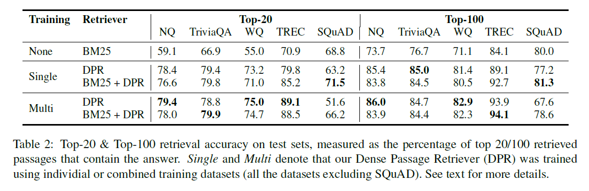
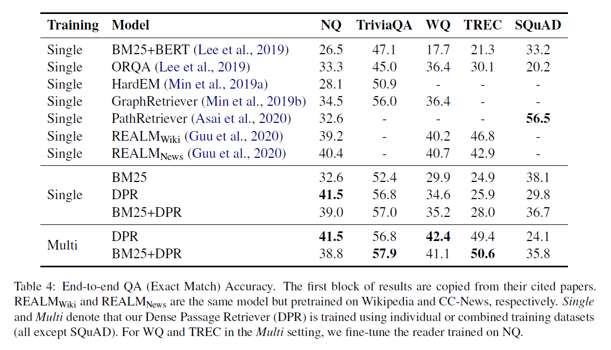

## DPR论文阅读笔记
2022.4.1
by Sunlly

### DPR
论文：《Dense passage Retrieval for Open-Domain Question Answering》by Vladimir Karpukhin ets. Facebook AI，EMNLP2020

提出 `DPR(Dense Passage Retrieval)`，利用密集表示（Dense representation）改进了开领域问答的检索（Retrive）阶段。首先利用两个 `BERT` 分别作为问题和段落的 encoder，从问题和文章段中提取 d维向量表示。通过内积计算问题和段落的相似度。同时改进了训练的损失函数，利用了 in-batch 的负样本对 encoder 训练。随后用 FAISS 检索库实现了快速检索出和问题最相关的前k个段落。

相较于常用的稀疏向量检索如 `TF-IDF` 和 `BM25` ，DPR 检索准确度有了极大提高（9%-19% than Lucene-BM25 in top-20），在多个数据集上的QA结果也有了很大提升。成为开领域问答检索阶段的重要新方法。

code: https://github.com/facebookresearch/DPR

### 研究点

+ Open-domain question Answering（开放域问答）

+ Retrieval（检索阶段），对于开放域问答，要从大量语料中找到相关的内容，检索是必要的。本文探究检索阶段的改进，同时提升了后续 QA 的准确率。

+ Dense representation，用密集向量表示基于问题和文章的相似度，encoder 基于 BERT，和 TF-IDF 和 BM25 等稀疏向量方法比，更加准确。同时提出用最简单的内积来判断相似性。

+ In-batch negatives Train, 提出 Loss 的表示，用 batch 内的 Gold passage 来作为负样本，效果最好。

### 以往研究

+ 检索器效果不佳，即使Reader部分的效果很好，也整体准确率不高。检索阶段成为开放问答的瓶颈
+ 稀疏表示 TF-IDF 和 BM25 对语义信息不敏感
+ 已有一些密集表示的研究，但训练需要大量的标注数据，在BERT提出前还没有人做到
+ 预训练模型BERT的出现和逆完形填空(inverse cloze task, ICT)的预训练方法的提出，很适合QA任务。但预训练的计算成本较高，同时没有用到 `问题+答案对` 对检索效果做提升，得到的结果可能次优。

### 模型

编码、相似度计算、encoder训练（微调）、索引

#### 1. 编码：基于BERT的编码器(encoder)

+ 目的：将问题和段落转化为密集向量表示
+ 方法：将问题和段落分别经过不同的编码器 $$E_Q(.)$$ 转换，得到d维度密集向量。此处用的BERT双编码器，d=768。

#### 2. 相似度计算：内积

+ 目的：计算问题和段落的相似度。
+ 方法：论文提到尝试了多种方法，包括余弦等，但是最简单有效的是直接求内积：
$sim(q,p)=E_Q(q)^TE_P(p)$。

#### 3. 索引

用FAISS（Facebook提出的一个搜索库，C++）建立索引，实现快速查找和问题相似度最高的k个段落。

#### 4. encoder训练

+ 目的：训练encoder，使问题和答案在转换成向量后距离较小。对于BERT来说相当于微调。
+ 输入：带标签的数据：成对的问题+段落对。训练段落称为Gold passage。
+ 损失函数：对于一个问题，同时利用正样本（positive passage，即和该问题成对的段落）和负样本（negative passages）训练。
$L(q_i,p_,^{+},p_{i,1}^{-},...) = -log(e^sim(q_i,p_i^{+})/e^sim(q_i,p_i^{+})+sum^n_{j=1}e^sim(q_i,p_{i,j}^{-}))$

+ 负样本选择：有三种方式：
  1. 随机从语料库选择
  2. 选经过BM25检索相关，但是并不包含answer的段落
  3. 从其他的gold passage中选

  论文中提到效果最好的方式是从同mini-batch中取n-1个gold passages，再加1个BM25选出的段落。

### 实验

#### Retirver
+ NQ(Natural Questions)：来自google search queries和标注的Wikipedia articles。
+ TriviaQA：网络爬取的问答。
+ WQ(WebQuestion)：
+ TREC(CuratedTREC)：
+ SQuAD v1.1：阅读理解的问答任务。问题中缺少段落的相关信息，不太适合开领域设置。

用BM25做基线。

指标用的是前20/100的检索段落中是否包含answer（注：感觉不太适合表格。）

#### end-to-end QA

在k个检索到的段落中提取段落跨度（span），并计算分数，取分数最高的跨度作为最终结果。

BM25对关键词敏感，但对语义关系处理差（基于词频，对同义词处理不好），而DPR擅长语义关系，但不太能处理突出的短语。经过多轮训练的BM25+DPR在某些数据集上能取得较好的效果。

### 读后启发

+ 将BERT替换为Tapas来强化对表格的embedding。（已经有人做过）
+ cross-attention的理解？
+ 通过QA阶段的验证来优化索引排序。应用到Text-to-SQL，可以用执行引导来提升检索候选的质量。（甚至强化检索的训练）
