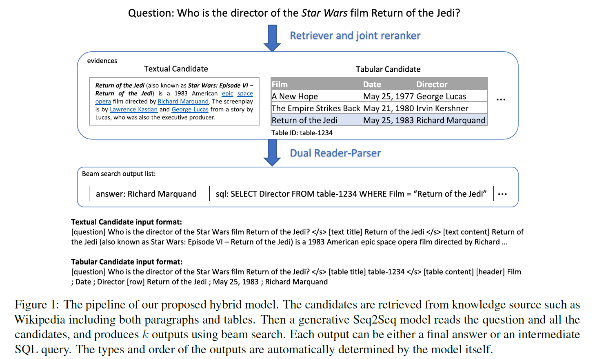

## DuRaPa论文阅读笔记

2022.3.24
by Sunlly

### DuRePa
论文：《Dual Reader-Parser on Hybrid Textual and Tabular Evidence
for Open Domain Question Answering》by Alexander ets. Amazon，ACL2021

提出dual reader-parser(DuPepa)用于处理开领域问答任务，并结合了Text2SQL的能力。生成模型借鉴了FID（fusion-in-decoder model, Izacard and Grave 2020)，主要的贡献在于使open-domain同时支持text和table（生成SQL）的处理。

code: https://github.com/awslabs/durepa-hybrid-qa

### 研究点

+ ODQA(open-domain question answering)，第一篇Text2SQL方面的开领域问答论文
+ Hybrid framework, both textual and tabular evidence, 支持文本和表格混合形式的证据
+ generate direct answers and SQL queries, 对于简单的问答，直接生成回答；对于复杂的问题，生成供表格查找结果的SQL，由系统自动判断生成的类型(answers or SQL)

### 以往研究的不足

+ 开领域问答（open-domain question answering, ODQA）：在没有给出特定域的情况下回答事实性问题，一般做法的方法是运用生成模型。以往的研究集中在从Wikipedia的free-form text提取支持证据。但更多的知识存储在结构化数据库中（structured databases），通过SQL才能查询到。

+ text2SQL：实现自然语言转SQL查询，但是以前只针对封闭领域（closed domain）做研究，即给定问题对应的表格。如果转换成开领域的情况，将从大量表格中提取证据，难度高。

(有支持同时从text和table中提取证据的数据集和对应方法，如OTT-QA（2020），但此方法不支持SQL生成。)

### 模型

三个步骤：检索、排名和生成

#### 1. retrieval system：检索系统

+ 目的：从开领域的文本和表格中检索和问题相关的候选，是一个初略的筛选。
+ 输入：问题、所有文本和表格。
+ 预处理：将长文本分为最多100 words的文本段(passages)，将各表格横向扁平化（flatten)，成为文本，再以100 words作为标准分段。
+ 筛选依据：BM25 function(Robertson, 1995)。
+ 输出：分别100个textual和100个tabular的候选(candidate)片段。
（注：BM25不太了解详细，但应该速度很快，毕竟要处理大量的文本和表格）

#### 2. Joint Reranking： 联合排名

+ 目的：为每个candidate（文本或表格）进行问题相关度(relevant)的评分。
+ 输入：问题+文本：[question]...[text title]...[text content]...
问题+表格：[question]...[table title]...[table header]...[table content]...
+ 模型：BERT_base，做fine-tune。
+ 损失函数：随机选63个neg的候选和1个pos的候选相减。如果没有相关的候选，跳过该问题。
+ 输出：50个top-score的候选。

#### 3. Dual Reading-Parsing： 双重阅读-解析

+ 目的：生成answer或SQL
+ 输入：问题+文本：[question]...[text title]...[text content]...
问题+表格：[question]...[table title]...[table header]...[table content]...,如果没有显式的table title，则用ID，便于后续的SQL生成。
+ 模型：基于fusion-in-decoder(FID)。生成模型运用seq2seq。运用波束带宽（beam search）获得生成的output（k=3，则获得3个output)。
+ 输出：前缀（Prefix， a special token of answer or sql）和具体的answer/SQL结果。对于WiKiSQL，执行SQL获得execution answer。

### 实验
+ OpenSQuAD：改自original SQuAD-v1.1 (Rajpurkar
et al., 2016)，主要是阅读理解的问答任务。
+ OpenNQ：改自NaturalQuestions (Kwiatkowski
et al., 2019)，端到端问答。来自google search queries和标注的Wikipedia articles。
+ OTT-QA： (Chen et al., 2020) 大规模开领域table-and-text问答数据集。包括5 million文章和400k表格。有多跳推理。

+ OpenWikiSQL开领域的Text2SQL
QA数据集，改自WikiSQL(Zhong et al., 2017)。
+ Mix-SQuWiki：混合自OpenSQuAD和OpenWikiSQL。
+ WikiSQL-both：同时结合文本和表格。从wikiSQL创建的wikipedia文本上组合而成。通过BM25进行相关度的判断。

OpenWiKiSQL上，durepa的混合形式证据比纯table高3.2%。  

(注：OpenWikiSQL上的准确度还不够高，有很大的提升空间。)

（代码公开了，但OpenWiKiSQL数据集没有公开）

（OTT-QA的回答高度依赖于text和table的联合推理。DuRePa中处理两者的关系为相互佐证，而不是如OTT-QA一般的必须两者同时结合取证，故DuRepa在其上效果不好）

### 未来工作

+ 可以不通过BM25，而是神经检索模型（neural retrieval model）(Karpukhin et al.,2020).来找和目标问题相关的证据。
+ 混合证据上使用实体链接（entity linking model）更好混合text和table证据。
+ 提升SQL生成质量、使用弱监督如离散EM。
