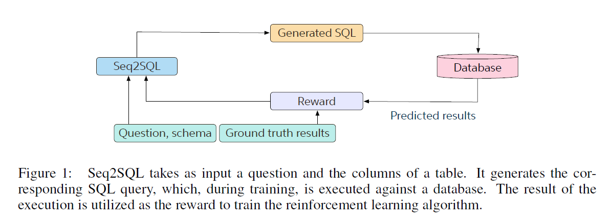
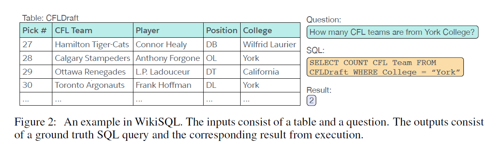
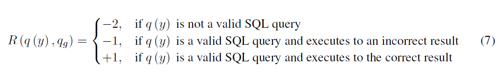
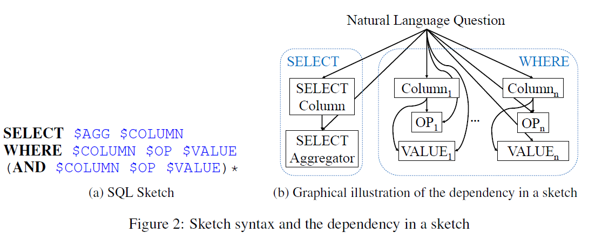

##NL2SQL组会论文阅读笔记
###1. seq2SQL
论文：《SEQ2SQL: GENERATING STRUCTURED QUERIES
FROM NATURAL LANGUAGE USING REINFORCEMENT
LEARNING》

论文创新性地提出了：

+ **Seq2SQL：**一个深度神经网络，使用到强化学习（reinforcement learning, **RL**）的机制创建查询语句产生时的条件，缩小输出的范围和提高准确率。

+ **WikiSQL：** 一个包含80000+SQL语句的自然语言和相应的SQL查询实例和SQL表的语料库，从Wikipedia的HTML表格中提取的跨领域数据集。与此同时还发布了一个查询执行引擎。

论文中Seq2SQL在WikiSQL上的\\(acc_{ex}\\)为59.4%。

---

#####模型：

Seq2SQL的输入为自然语言描述的查询问题\\(q_{nl}\\)和数据库模式\\(S_D\\)，输出为SQL语句\\(q_{SQL}\\)。

######技术：

**增强指针网络（augmented pointer network）：**

实现输出到输入（表模式，问题语句，SQL关键词）的指向，缩小了输出的范围。

**网络结构：**

输入\\(x\\)为列名+sql关键词+自然语言问题的连接；

encoder中为两层LSTM,增加指针机制；

decoder为两层LSTM，有注意力分数等；

输出时，选择分数最高的输入token作为下一个输出的词。

（**ps：**_模型不难，输入也很好理解，但是会面临unseen问题_）

**三个组件（components）：**

+ 聚合运算符（aggregation operator），用来选择统计运算操作，如COUNT，MIN，MAX，没有则为NULL。
+ 查询列（SELECT column），确定查询的列名，指针指向数据库模式。
+ 条件组（WHERE clause），加以查询的条件限制。

混合三者得到目标函数，使用梯度下降法训练。

优势：利用了SQL语句的固定结构（structure inherent），（ps：同时也很死板，限制了模型的适应性）

**强化学习：**

第三个组件，即Where条件组中，由于本身的顺序不定，因而不适合使用交叉熵（cross entropy）对模型优化，因此使用规则的强化学习(policy-based reinforce learning)生成查询结果的条件。

对执行结果正确，但是和ground truth不同的SQL生成结果加以惩罚，使得生成结果尽可能标准化。

---

#####数据集：

WikiSQL相比之前的数据集，在数量级上更大，对模型在新的查询和新数据库模式的泛化能力上，提出独有的挑战。

（**ps：**_WikiSQL每次查询只针对一个表的内容做查询，没有join等表连接的操作。由于只涉及到对单表的查询，因此From+表名可简化。该数据集和真实情况相比，过于简化。_）

数据来源于Amazon Mechanical Turk，收集过程分为两个阶段：paraphrase phase、 verification phase。

######评价指标：

执行准确度\\(acc_{ex}\\)：执行后的结果相同。

逻辑形式准确度\\(acc_{lf}\\)：和gound truth的SQL语句字符串完全相同，在训练过程中会对执行正确但是字符串不匹配的结果，也加以惩罚。

（**ps：**_由于执行结果相同的SQL语句不一定语义等价，所以我们会更期待能达到字符串匹配的效果；或者实现输出句式的标准化。但这里可能存在where条件中的顺序问题等，所以个人认为这样的评价指标很不准确。_）

---

#####实验结果：

对比了Seq2Seq，相比之下Seq2SQL的准确率有了很大提升。（10%++）

使用了强化学习、指针网络技术的Seq2SQL准确率较高。

---

---

###2. NSP
论文：《Learning a Neural Semantic Parser from User Feedback》

创新点：

+ **一个神经模型：**充分而直接地将自然语言的映射为SQL语句，并跳过中间表示和数据库特征工程。
+ **用户反馈机制：**实时性地在网络上部署模型，在线征集用户意见，通过用户的反馈来促进模型的改进。减轻手工标注的工作量，迅速地适应多领域。

---

#####模型：

NSP使用encoder-decoder模型，带全局注意力机制。匿名化应用于encoder中的LSTM网络，decoder直接预测SQL query token。

######技术：

**用户反馈学习（feedback-bases learning）：**

在权衡了人工标注投入精力和模型训练效率后，采取二元判断正确与否的方法收集用户反馈。

在模型训练和做预测之间转换，对于新的表述，生成SQL语句并得以执行结果，交予用户判断。正确的结果，将\\((n,q)\\)对加入训练集，错误的结果，交予人工修改订正后，将\\((n,q')\\)加入训练集。

随着使用，模型的预测能力得以增强。

**实体匿名化（entity anonymization）：**

对于表述和SQL中的实体，用类别替代。使用增量编号，为同类型的多个对象建模。

（ps：后续待理解和消化。）

**数据增强（data augmentation）:**

交互学习和外部语义化资源。

（ps：后续待理解消化。）

---
---

###3. SQLNet
论文：《SQLNet: GENERATING STRUCTURED QUERIES FROM
NATURAL LANGUAGE WITHOUT REINFORCEMENT
LEARNING》

论文指出了以往研究成果的问题：

+ **顺序问题（order-matters problem）：**以往的方法，采用seq-seq模型，将\\(q_{nl}\\)和\\(q_{sql}\\)都视为序列对待，训练一个语义分析器来实现两者的转换，这种方法对序列高度敏感。
+ 
最具挑战性的是WHERE条件组。由于限制条件的交换性和结合性，不同的SQL语句很可能在语义等价。
基于序列的方法将语义等价的SQL查询视为不同的查询，对于SQL语句的语义等价的问题解决的不好。

+ **强化学习的效果不佳：**为缓解顺序问题，以往的一种经典方法是采用强化学习，对非符合ground truth的生成结果进行惩罚，以达到限制输出格式的效果。策略梯度算法可以运用这种奖励来微调模型。
+ 实际上提升的效果并不理想。在seq2SQL中，强化学习仅提升了2%。

（**ps：**_说的就是seq2SQL的局限性，研究点上有承接，且看本论文是如何克服上述模型的局限性的。
抓住了seq2SQL中没有很好地解决的顺序问题。
在seq2SQL中的优点强化学习，到本文中变成了缺点，即提升效果微乎其微。_)

论文创新点：

+ **基于草图的方法（sketch-based approach）：** 草图自然地与SQL查询的语法保持一致。

+ 可以被视为神经网络替代传统基于草图的程序合成方法。目前有利用草图和神经网络结合的方法，但草图具有粗粒度（coarse-grained）并且使用seq-seq模型来填充草图的槽。
+ 草图包含了依赖图（dependency graph），一个预测的做出，只需考虑前面所依赖的预测。避免了seq-seq模型带来的顺序问题。
+ **序列到集合的模型(sequence-to-set model)：**创建一个无需的条件集合，替代有顺序的条件序列。
+ **列注意力机制（column attention mechanism）:**用于捕捉草图定义的依赖关系，和前者配合，用于综合基于草图的查询。
+ **SQLNet:** 综合上述所有创新性的技术，得到比之前更好的模型。用草图中的槽（slot）来预测内容。在WikiSQL任务的提升较现有技术提升了9%-13%。

---

#####实验结果：

在WikiSQL上做了评估，\\(acc_{qm}\\)即查询的精确匹配准确率，达到61.5%，\\(acc_{ex}\\)即结果匹配准确率达到68.3%。\\(acc_{ex}\\)

对比了seq2SQL，准确率有了很大提升。（前面两个评价指标的提升幅度分别为7.5%，8.9%）

使用WiKiSQL变体，即将WikiSQL的训练集和测试集混合来模拟实际情况，达到70.1%的准确率，比seq2SQL仍高2个点。

---

#####数据集：WiKiSQL

+ **优点:** 
+ 1.数据集大，模型可做充分的训练；
+ 2.使用网络众包资源收集，自然语言由人类创建，有利避免过拟合状况；
+ 3.任务只涉及表模式，不涉及表格中的具体内容，有利于解决敏感的数据隐私问题；
+ 4.分为训练集，测试集，验证集且之间无交集，有效检测模型对新的数据库模式的适应性。

+ **缺点/限制:** 
+ 1.每个SQL查询生成只涉及一个表格，因而省略了FROM语句；
+ 2.假设了列名都是有意义的自然语言描述；
+ 3.假设了输出仅限于SQL关键词和在\\(q_{nl}\\)已有的词语，条件中的数值也是同样；
+ 4.假设了WHERE条件句的op仅包括等于、大于、小于等。

即使面临着多假设和局限，本论文仍然使用了WiKiSQL数据集，其不但是当时最大的数据集，并对于当时研究来说仍是很大的挑战。

---

#####模型：

SQLNet使用基于草图（sketch）的技术，和SQL自身的语法高度对齐，因此只需要填充槽，而不用同时预测输出的语法和内容。

草图被设计为通用，并捕获预测间的依赖性。

引入seq-to-set和列注意力两种技术。

任然是从\\(q_{nl}\\)和\\(S_D\\)中合成\\(q_{sql}\\)，但避免了seq2seq和强化学习。

（ps:为什么捕获依赖性就能避免顺序问题？）

######技术：

**基于草图的查询合成（sketch-based query synthesis）：**

在草图中，粗体表示SQL关键词（SELECT，WHERE，AND等），
$代表槽，待填充的词（$AGG，$CONLUMN，$VALUE，$OP等），*后面还可以连接更多的AND和表达式。

在依赖图中，每个框代表待预测的槽，每个依赖用有向边表示。可以把SQL语句的生成问题，看成依赖图的推理问题。这样，每个约束和其他约束彼此独立，避免了顺序问题。（例如图中的Column1和Column2，彼此间没有连通）

虽然这个结构很简单，但已能应对WiKiSQL任务的所有情况。事实上也可将seq2SQL看作基于草图的方法，但是由于AGG和COLUMN对WHERE簇依赖，存在顺序问题。

（**PS：** 结构如此限制和简化，并为WiKiSQL而刻意设计出的草图方法，很显然，对于有GROUP BY和JION操作的更加复杂的查询，该结构不适用，或者说，要进行结构上的扩展才能有一搏之力。）

**序列-集合（sequence-to-set）和列注意力（column attention）：**

出现在WHERE簇的列名可以看成所有列名的一个子集。模型只需要预测哪些列名出现在感兴趣的列名子集中。

用一个双向LSTM的隐藏层状态来计算列名在子集中的概率\\(P_{wherecol}(col|Q)\\)。

为了增加对列名相应的自然语言信息的学习，运用列注意力机制，以\\(E_{Q|col}\\)取代\\(E_Q\\)。

**WHERE的COLUMN槽的预测：**

对于列名的选取，一种方法是设置概率的阈值\\(\tao\\)，超过阈值的列入选。本文中使用了效果更好的方法，即使用神经网络预测入选的列数K，并选择概率较大的K个列。由于观察到大多数查询的列数有限，设置K的上限为N,并将预测K转化成\\((N+1)\\)-路分类问题。

（PS:N可能与WiKiSQL数据集自身的性质有关。）

**OP槽的预测：**

看成3-路分类问题，分别为=，>，<。
运用了列注意力和依赖独立性。

**VALUE槽的预测：**

使用seq2seq结构的模型来预测数值。
运用了列注意力和依赖独立性。

---

#####训练细节：

**输入的编码细节：**将自然语言和列名都看作一系列的token。用了Stanford CoreNLP tokenizer来对句子语义化。每个token用one-hot形式表示，并在输入双向LSTM前就进行了embedding处理。使用Glo Ve embedding。

**训练细节：**用一个特殊的损失函数来训练序列-集合模型：奖励正确预测和惩罚错误预测。

\\(loss(col,Q,y)=-(\sum(\alpha y_i log P_{wherecol}(col_j|Q)+(1-y_j)log(1-P_{wherecol}(col_j|Q))))\\)

本文中超参数\\(\alpha=3\\)

模型所包含的多个LSTM在权重上不共享，仅对word embedding共享。

---

#####评估：

**评价指标：**

+ \\(acc_{lf}\\) 直接将\\(q_{sql}\\)和ground truth进行匹配。
+ \\(acc_{qm}\\) 将生成的SQL预测结果和ground truth均转换为范式表示，然后做匹配，消除了顺序造成的准确率的错误估算。
+ \\(acc_{ex}\\) 执行准确度。

对细分的子任务，即agg、select、where的准确性也进行了单独的测试。

在Pytorch的实现中，seq2sql没有源码，论文自己写了代码，比原版的效果要更佳。

**训练细节：**用一个特殊的损失函数来训练序列-集合模型：奖励正确预测和惩罚错误预测。

\\(loss(col,Q,y)=-(\sum(\alpha y_i log P_{wherecol}(col_j|Q)+(1-y_j)log(1-P_{wherecol}(col_j|Q))))\\)

本文中超参数\\(\alpha=3\\)

模型所包含的多个LSTM在权重上不共享，仅对word embedding共享。
