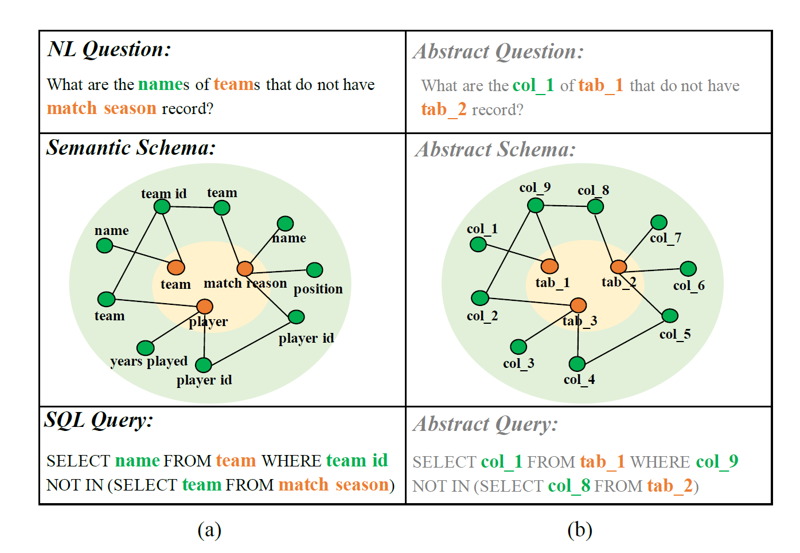
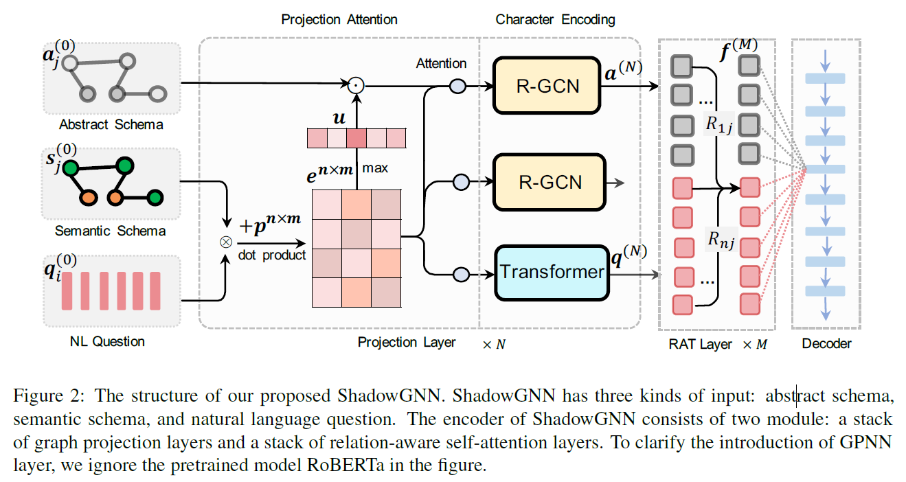

##shadowGNN论文阅读笔记

2021.7.27

###TaBert
论文：《ShadowGNN: Graph Projection Neural Network for Text-to-SQL Parser》

ACL 2021

**论文创新点：**

为了提升模型对不可见数据库模式（unseen schemas）的泛化能力，提出ShadowGNN，以抽象和语义级别来处理数据库模式（schemas）。

在论文中，一个数据库的模式（database schema）被视为一个域（domain），一个域的信息由两部分组成：语义信息（如表名）和结构信息（如表和列的主键关系）。

通过忽略数据库语义项的名称，利用抽象模式在图投影神经网络（graph projection neural network，GPNN）中获得问题和数据库模式的表示。

通过语义无关的表示，利用关系感知转换器（relation-aware transformer， RAT）来提取问题和模式的逻辑链接（logical linking）。最后，用了上下文无关语法（context-free grammer）的SQL解码器。

**实验结果：**

ShadownGNN在Spider数据集上做测试，取得先进的结果，当标记数据(annotated data)十分有限时（10%训练集），ShadowGNN得到超过绝对5%的表现。（PS:在有限条件下的实验结果没有理解？）

代码地址：at https://github.com/WowCZ/shadowgnn (暂时未发布)

（PS：缺点：没有用到表格内容,同时问题中的表述很可能和表、字段的表述不会完全相同。

运用RoBerta作为预训练模型，效果一般。

还有一个问题，个人感觉模型手工设计痕迹严重，解码部分用的方法不够先进。）

---

####问题背景

Text-to-SQL任务将自然语言转化为SQL查询。目前在公开Text-to-SQL数据集上，精确匹配度达到80%以上，但是，在跨领域的情景下，传统的语义分析模型对于不可见数据库模式（unseen database schemas）适应性不佳，跨域问题（cross-domain problem）仍具有很大的挑战。

Spider(2018)是一个跨域的数据集，测试（test）中的数据库模式，对于训练集是完全不可见的。该情景的挑战性在于两点：第一，在测试集（development set）中，35%的词在训练集（training set）中不会出现。第二，数据库模式总是包含语义信息，很难得到统一的表示。

为了缓解这种情况，首先要清楚模式中的哪些语义信息在从NL翻译到SQL中起到关键作用。在图1 中，列名和表名是需要被Text-to-SQL模型找到的。一旦自然语言中提到的列和表名与模式组件能精确配对，我们就能抽象出NL问题和语义模式，通过用特定的模式组件替换掉一般的组件类型。（PS:这个地方太绕，没全懂。）

---

####模型

ShadowGNN的总流程如图2，在阐释结构时暂时忽略了预训练模型RoBERTa：

模型的输入为自然语言问题Q和语义模式G。在ShadowGNN中，encoder可以分解成两个模块：

1. GPNN：提取域的信息。
2. 关系注意力transformer：进一步获取问题和模式的表示。

两者结合起来，模拟了人类在跨域情景下，将自然语言转换转换成SQL查询的过程：抽象（abstracing）和推理（inferring）。

（PS：思想非常好，让人眼前一亮。思路和人类写SQL的过程很接近。）

**图投影神经网络GPNN：**

三部分输入：抽象模式（abstract schema），语义模式（semantic schema）和NL问题。下面是具体的表示方法：

抽象模式：节点的类型（table或者column），没有任何域信息，被看成语义模式的投影（projection）。用one-hot vector aj(0)的两维向量来表示。

语义信息和NL问题：通过预训练模型RoBERTa来初始化表示。论文中直接将两者以"[CLS] question [SEP] tables columns [SEP]"拼接（concatenate）。语义模式中每个节点名都可以标记为几个子标记（sub-token）或子词（sub-words）。在RoBERTa后面接了一个平均池化层，实现子标记到相应节点的对齐。用qi（0）和sj(0)来表示NL问题和语义模式。

GPNN的主要动机是抽象问题和模式。最具挑战性的是抽象出问题的表示。每个GPNN层中有两个独立的操作：注意投影（projection Attention）
和字符编码（Character Encoding）。

注意投影利用语义模式作为桥梁，其中问题使用抽象模式来更新表示。而注意力信息将由语义模式的向量进行计算。

字符编码部分，对于使用投影注意更新后的三种向量，用R-GNN和Transformer分别进行编码，增强了问题和模式图的结构表示。

经过N层的GPNN后得到模式的抽象形式和问题的表示，即a(N)和q(N)。

（PS：注意投影和字符编码的具体细节不太理解。）

**模式链（schema linking）：**

模式链被视为一种先验知识，根据匹配度（matching degree）对问题和模式之间的关联进行表示。

有七种标记（tag）：Table Exact Match, Table Partial Match, Column Exact Match, Column Partial Match, Column Value Exact Match, Column Value Partial Match, and No Match

（PS：如何获得标记类型？）

模式链的表示为//(D=d_{ij}^{n,m}//)，d_ij表示问题中的第i个词和模式中的第j个节点。d_ij也用one-hot表示匹配的标记类型，构成p^{n*m}矩阵。

**关系注意力模型（RAT）：**

用RAT来对GPNN输出的问题和模式进行统一的表示。

将q(N)和a(N)进行拼接，作为Rat的初始输入。最后得到f(M)。

**解码器：SemQL语法器：**

在论文IRNET中，涉及到了的上下文无关SemQL语法，用于生成抽象语法树（AST）。SemQL没有涵盖SQL的所有关键字，比如，GROUPBY子句中包含的列可以由SELECT子句或聚合函数应用于其中一个表的主键中推断出来。（PS：原文长难句，没有完全理解。）

本论文对SemQL的语法进行了改进，使得SQL句子的每个关键词都能与SemQL节点对应。训练中，训练集的标注SQL需要转成AST，而评估过程，AST需要恢复为SQL。本文改进的语法将恢复的准确率提升到99.9%。

使用粗到细的方法（coarse-to-fine approach），和IRNet中类似。将SemQL的decoding分为两个阶段，第一阶段是使用框架编码器（skeleton decoder）来预测SemQL的框架。然后，一个细节编码器（detail）填充缺失的细节，选择列和表。

（PS:在哪可以看到改进后的SemQL语法？）