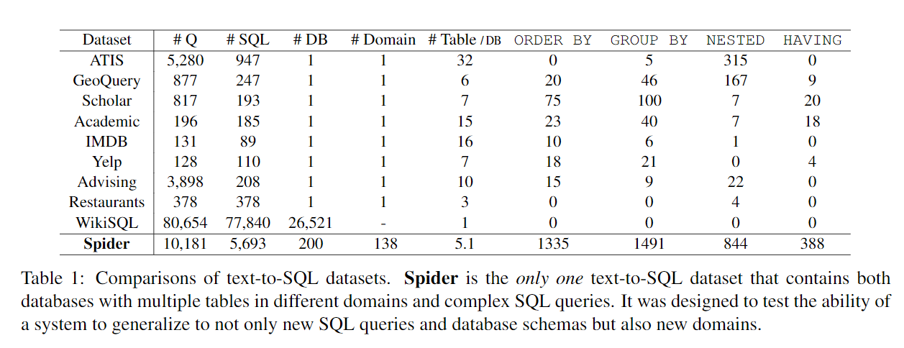
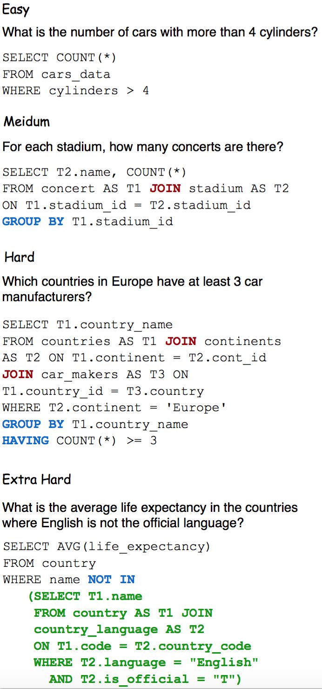

## Spider论文阅读笔记

2021.9.14

### Spider
论文：《Spider: A Large-Scale Human-Labeled Dataset for Complex and
Cross-Domain Semantic Parsing and Text-to-SQL Task》
NAACL2019

Tao Yu Rui Zhang,Yale University

Spider是一个大型的、复杂的、跨领域的语义解析和文本到sql的数据集，由11名耶鲁学生注释的文本到 SQL 数据集，它的目标是开发跨域数据库的自然语言接口，

它包括10.18个问题和200个数据库上的5,693个独特的复杂 SQL 查询。为了做好这项工作，系统不仅要能很好地推广到新的 SQL 查询，还要能推广到数据库模式。

我们之所以称之为“蜘蛛”，是因为我们的数据集是复杂的、跨域的，就像一只蜘蛛爬过多个复杂的数据集(有许多外键)的巢(数据库)

任务需要模式很好地泛化新的SQL查询和新的数据库模式。Spider不同于以前的大多数语义解析任务，因为它们都使用一个数据库，并且在训练集和测试集中使用完全相同的程序。我们用各种最先进的模型进行实验，在数据库分割设置上，最佳模式只能达到12.4%的精确匹配精度。这表明蜘蛛对未来的研究提出了巨大的挑战。

为了生成给定输入问题的SQL查询，模型需要理解自然语言问题以及数据库模式中表和列之间的关系

模型不仅需要泛化到新的程序，还需要泛化到新的数据库。模型必须将问题和数据库模式作为输入，并预测新数据库上的未见查询。为了评估任务的难度，我们试验了几种最先进的语义解析模型。在数据库分割设置中，最佳模式只能达到12.4%的精确匹配精度。这表明，还有很大的改进空间

链接：https://yale-lily.github.io/spider

**和其他数据集的对比：**

ATIS、Geo、Academic：这些数据集都只包含一个数据库。而这些数据库大部分仅包含不到 500 个独特的 SQL 查询。基本上，在这些数据集上训练的模型仅对特定的数据库有效。在转换数据库后，模型将完全失败。

WikiSQL：SQL 查询和表的数量很多，但是所有 SQL 查询都很简单，仅包含 SELECT 和 WHERE 从句。此外，每个数据库都只是没有外键的简单的表。在 WikiSQL 上训练的模型在其它新数据库上仍然可以运行，但是该模型无法处理复杂的 SQL（如 GROUP BY、ORDER BY 或嵌套查询）和具备多个表和外键的数据库。

ATTS、Geo、Academic：每个数据库都只包含一个数据库，SQL 查询的数量是 ed，并且具有完全相同的 SQL 查询 在训练和测试拆分中 WIKISQL：SQL 查询和表的数量非常大。 但是所有的SQL查询都是简单的，每个数据库都只是一个简单的表，没有任何外键。Spider 1.0跨越了最大的第一个复杂的跨域语义解析和text-to-SQL数据集！

以前的大多数工作都将模式作为输入来训练它们的模型，因为它们使用单一数据库来进行训练和测试。准确率被夸大，且基于模板的方法能取得较好效果。

Zhong等人(2017)发布了WIKISQL数据集。在他们的问题定义中，测试集中的数据库不会出现在训练集或开发集中。也。该任务需要将不同的表模式作为输入。因此，该模式必须推广到新的数据库。然而，为了为24241个数据库生成80654个问题和SQL对，Zhong et al.(2017)对SQL查询和数据库做了简化假设。它们的SOL标签只涵盖单个SELECT列和聚合以及WHERE条件。而且，所有数据库只包含单个表。

**难度标准：**

为了更好地理解模型在不同查询上的表现，我们将 SQL 查询分为 4 个级别：简单、中等、困难、特难我们根据SQL组件的数量定义难度。

选择和条件，因此包含更多 SQL 关键字（GROUP BY、ORDER BY INTERSECT、嵌套子查询、列选择和聚合器等）的查询被认为更难。

 例如，如果查询包含两个以上的 SELECT 列或两个以上的 WHERE 条件和 GROUP BY 两个列，或者包含 EXCEPT 或嵌套查询，则该查询被认为是困难的。 在此基础上添加更多内容的 SQL 被认为是非常困难的。 图 3 显示了 4 个难度级别的 SQL 查询示例

**任务：**
在提出的数据集之上，我们定义了一个文本TO-SQL任务，该任务比之前的语义解析或文本TO-SQL任务更现实，模型将在不同领域的不同复杂SOL查询和不同的复杂数据库上进行测试。它的目的是确保模型只有在真正理解问题的意义时才能做出正确的预测，而不仅仅是记忆。是的，因为我们的数据库包含不同的域。我们的语料库测试了模型对新数据库的泛化能力。

**前提假设：**
在我们目前的任务中。我们不评估模型性能的产生价值。在现阶段，基于当前各种最先进的模型在我们的任务中的表现，预测正确的 SQL 结构和列更加现实和关键。在不与用户交互的情况下预测状态值是不现实的。实际上，大多数人都知道要询问什么值，但是不会降低 SQL 逻辑的级别。一个更合理的方法是要求用户使用界面搜索价值观，然后问更具体的问题。此外，其他以前的工作与价值预测使用一个单一的数据库在训练和测试，使其容易过度拟合。然而，SQL 查询必须包含值才能执行它们。对于我们任务中的价值预测，给出了每个问题的金值列表，模型需要将它们填入其预测 SOL 中的正确位置

在前面的章节中提到过。排除了常识推理、数学计算等需要外部知识边界的查询。例如，想象一个有生死年列的图表。回答“ x 的生命长度是多少?”？我们使用 SELECT death _ year birth-year。尽管这个例子对人类来说很简单。它需要一些关于寿命长度定义和数学运算的常识。这不是我们数据集的焦点

我们假设数据库中的所有表名和列名都是清晰和自包含的。例如，一些数据库使用特定于数据库的简化名称来命名表和列名，例如“ stu _ id，我们在语料库中手动将其转换为“ student id”
