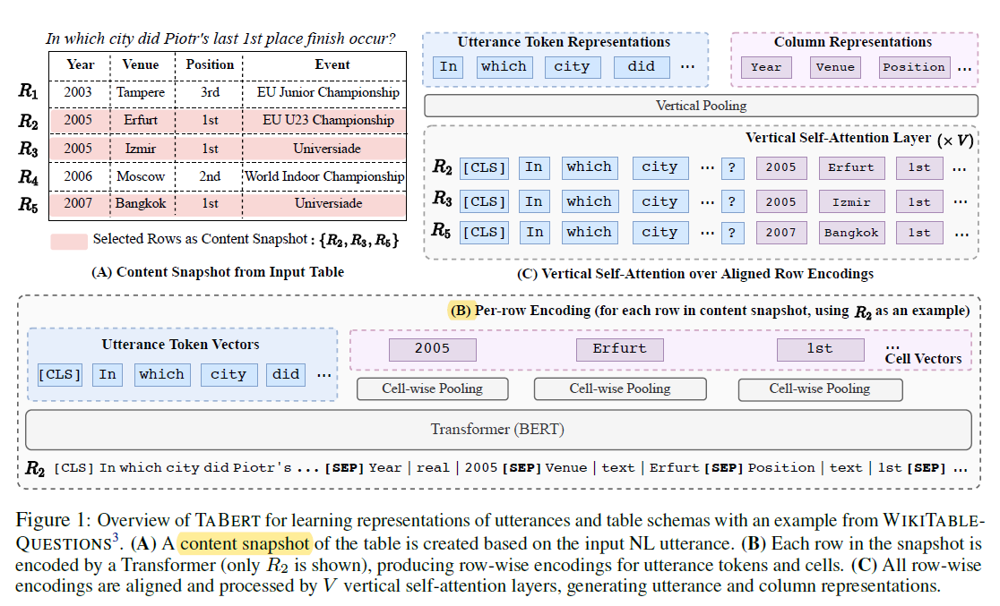

##TaBert论文阅读笔记

2021.7.9

###TaBert
论文：《TABERT: Pretraining for Joint Understanding of
Textual and Tabular Data》

ACL2020

背景：预训练模型（Pretrained language models, LMs）越来越多运用于自然语言的理解任务。也得益于此，在自由形式的自然语言方面的理解和问答能力快速提升。

Bert这样的大规模预训练模型，允许以无监督的方式捕捉文体的语法和语义的表示，后续再通过微调实现下游任务。预训练的任务很简单，被建模为文本跨度选择问题（text span selection problems）（PS：Bert的两种预训练任务： Mask和Next Sentence Prediction），跨度边界的答案可用简单的分类器在LM之上进行预测。

（**PS：**这里的“跨度选择”不懂说法的由来，和具体的含义。）

**论文指出之前研究的问题：**

1.模型通常在自由格式的NL文本上训练，如Bert，不适合结构化数据的语义解析任务（典型例子：同时包括自然语言和数据库表的NL2SQL任务，对于该任务。自然语言和数据库表的格式之间的对齐（alignment），有着重要的意义）。

2.LM的容量有限。一个数据库表有多行，将其全部encoding进使用大量资源的LM是不现实的。（PS：比如Table Bert，将表格全部信息转换成文本序列。对于庞大的数据库显然是不实用的。）

3.和大多数基于文本的QA任务不同，其他任务可以通过预训练加上简单的分类层就能解决，而文本分析任务是高度领域相关的，神经语义器也和具体的DB匹配。现有研究只针对在DB的信息进行编码，没有考虑结构信息的预训练表示。

**论文创新点：**

1. 提出TaBert，一个同时能学习自然语言句子和半结构化、结构化表的预训练模型，在bert基础上建立。使用大型语料库训练，包含2600万表格和英语文本。
TaBert将表的结构进行线性化，兼容于基于Transformer的bert模型。
可以插入神经语义分析器，作为通用目的的encoder，对自然语言和表的表示进行计算。

2. 为了应用于大型表格，提出_内容快照（content snapshots）_，一种能对与输入最相关的表格内容子集进行编码的方法。该策略进一步结合了垂直注意力（vertical attention）机制，来共享不同行的单元格表示（cell representations）的信息。

（PS：Ta-可能是Tabular Data的意思。）

**实验结果：**

使用TaBert的作为特征表示层的神经语义分析器，在弱监督的基准集WiKiTableQuestions上取得很好效果，并在text-to-SQL任务的Spider上表现出很强的竞争力。

运用到了两种不同的语义分析范例：1.一个经典的监督学习配置，在spider数据集上。TaBert微调并使用在具体任务的解析器上，并行运用NL描述和带标签的DB查询。2.一个弱监督学习benchmark：WTQ,系统必须学习从执行结果中推测潜在的DB查询。

在两种情况下，TaBert均有效，这表明它是解析器原encoder的替代品，用于计算NL语句和DB表的上下文表示。经过TaBert增强的系统性能优于先进的模型，在spider和WTQ数据集上展示出竞争力。

（PS：待补充知识：n-gram，GloVe，Bert原文等。）

---

####问题分析

1. **对于自然语言到SQL查询的转化：**数据库表是结构化的，一般有强类型和规则化的内容（比如distance中的单位均为km，存储时只包括数字）。也可能时是半结构化的数据（比如distance的单位不同）。本论文研究的数据库模式称为列集（the set of column）并将其向量化。（更复杂的数据库模式还包括通过主外键表示的表间依赖性等）

2. **遮罩的语言模型（Masked language models）：**对原自然语言的一系列token中，随机取一个\\(x_m\\)进行遮罩，得到剩下token为\\(\tilde{x}\\)。模型对每个token预测概率p，经过最大化条件概率\\(p(x_m|\tilde{x})\\)这样一个简单任务的训练来实现对NL中语义的学习。预训练结束后，得到每个token的参数化表示。后续的下游任务会在此基础上微调。

---

####模型####

TaBert对于一个自然语言描述\\(u\\)和表格\\(T\\)

(A)首先创建一个内容快照（content snapshot）,由和输入的u相关的部分行构成。

(B)对于内容快照的每一行进行线性化，组合成为字符串，作为Transformer的输入，输出对话语标记和单元格的行级编码。

(C)经过一个垂直自注意力层（vertical self-attention layers），其中，各单元格的表示（话语token表示）倾向于由通过一列的垂直对其的向量来计算。

最后，从池化层（pooling layer）生成话语标记和列的表示。

(**PS：**突然想到一个问题，对于seq2SQL和SQLNet这样的模型，作为输入的数据库模式只包含表的列名，而不涉及表内容，因此学习SELECT和WHERE选择某列时，只能通过训练集学到NL的token与列名，建立关联。但对于训练集没有出现的token，模型怎能知道它与某列建立关联呢？比如地名，模型能知道Moscow是地名吗，虽然在表中的Venue列中包含这个token，不过模型没学过啊。由此可见，没有利用表内容作为输入，是有极大缺陷的，这大概是综述中提到的问题：对于某些查询，模型倾向于选择查询次数最多、最常用的输出列，很明显这样是错误的。)

######技术：

**内容快照（content snapshot）：**

单用列名容易有歧义（例如，图中的 Venue 列。用于回答实例问题的1实际上指的是主办城市（host city），在创建其表示的同时对采样单元值进行编码，有助于将输入话语中的“城市(city)”一词与本栏相匹配。），因此在Tabert中，充分利用了表中的内容信息。

但表格的行数往往过多，仅有少数是与问题相关的，因此没有必要用资源消耗较大的Transformer对所有内容进行编码。因此，使用了内容快照（content snapshot）来提取最为相关的特定行。

（PS：这里如何标定每行呢？如果用数组序号1,2,3...标记行，而当表的内容变化，比如行数增加或减少，或内容update后，模型是否需要重新训练？且看下文……）

设快照选定的行数为\\(K\\)。K>1时，选择与自然语句n-gram重合率最高的K行。K=1，选择从有最高n-gram重合率的列的单元格合成行。

如“How many more participants were there in 2008 than in the London Olympics?”，和Year, Host City 、Number of Participants这几列都有关，而最相关的单元格 ：2008 (from Year)和 London (from Host City)，来自不同行。若是合成行，则行内可以同时包括这两者信息，更有益于训练的稳定。

（PS:K如何确定，算是超参数吗？论文中提到合成行，但是还是没有理解其与K=1以及n-gram重合率的关联。）

（PS：这种模式下局限仍很大，还是只能处理单表）

**行线性化（row linerization）：**

TaBert为内容快照的每一行进行线性序列化，一个行R2的线性化例子见上图(B)，由语句描述，列名，单元格值组成。对于每个单元格，由列名、列类型（文中仅有text和real）、单元格值组成。

所有的单元格都线性化，以[SEP]分隔，构成行的线性化。前面再加上自然语言的token序列，构成Transformer的输入。

**垂直列注意力机制（Vertical Self-Attention Mechanism）：**

Tabert中的基本Transformer输出的为自然语言和每行单元格的编码。行集的向量由格行独立计算得到。为了让信息在不同行的单元格之间流动，论文提出了垂直注意力（Vertical self-attention），用于在不同行之间的对齐（align）。

（PS：不太懂这里的align，还有前面遇到的align。具体含义和如何操作？）

TaBert有V个叠加的垂直自注意力层。为了生成对齐的输入，首先对Transformer的输出向量（可变长度线性化）经过平均池化（mean-pooling）后，计算出每个位置\\((i,j)\\)的单元格的初始向量；然后将基本Tansformer模型中的NL语句的词向量序列，连接单元格向量，作为垂直注意层的输入。

每个垂直注意层和Transformer层有相同的参数，但是垂直对齐的元素分别对应相同问题token和列。该机制允许不同行信息的聚合，允许Tabert捕捉行级的单元格值的依赖。

最后得到了自然语言各toke、列的表示，单元格的表示，用于下游的训练。也输出一个可变长的表T表示，带前缀[CLS]符号，对于多DB表的分析器很有用。

（PS：这一块没有理解透。垂直注意力层输入的是Transformer的输出，即行向量化的encoding？为什么要用池化？如何实现多行信息聚合呢？）

---

####预训练过程####

**训练数据：**

用Web的半结构化数据表作为替代的数据源。使用英语的Wikipedia和WDC WebTable包含的表格和NL文本作为训练语料库。原始数据（raw data）非常嘈杂（noisy），在经过启发式的清洗后，筛出掉无效的例子。得到2660万个表和NL句子。使用Wordpiece进行标记化（tokenizer）。

（PS：对WDCWebTable和Wordpiece这两个东西不了解）

**无监督学习任务（Unsupervised Learning Objectives）：**

运用不同任务来学习自然语言和结构化表的上下文表示。在以往研究中，对于自然语言，使用遮罩语言模型（Masked Language Modeling，MLM），掩盖15%的子标记。

论文提出两个新的任务对列表示学习，基于这样的直觉：列表示应该包含列的名称、数据类型等元信息，又包括和NL上下文相关的代表性单元格值。

第一，提出**遮罩列预测（Masked Column Prediction，MCP）**，随机选择20%的行线性化中列的名称和类型的进行遮罩，Tabert运用多标签分类，来预测恢复该列，以达到对模型训练。

第二，运用辅助的**单元值恢复（Cell Value Recovery，CVR）**任务，确保在经过垂直注意力层之后，内容快照中的单元格值的信息被保留。对于每个在MCP任务的遮罩列，CVR从单元格向量中，预测每个在内容快照中的单元格\\(s_{(i,j)}\\)的原始的token。

由于每个单元格有多个token值（PS:没懂为啥？），应用基于跨度的预测任务（PS：不懂这个概念？）

（PS：CVR的具体实施过程没理解。）

---

####应用####

应用到两种不同的情形：在结构化DB运用经典的监督学习，以及在半结构化DB运用弱监督语义分析问题。

1. 经典监督例子：选用Spider数据集，在其中为获取结果，需要连接多表。在基本语义分析器上，开发了内部系统（in-house system，PS:facebook?）：基于TranX的系统。TranX基于用户定义的语法，将NL语句转化为中间义的表示（meaning representation，MR），然后MR被转化为特定域的查询语言（比如SQL）。转化结果为SemQL，一种SQL语言的简化版。

2. 弱监督例子：弱监督无法获取标记的查询（labeled query），只能从执行结果推断正确性，更具有挑战性。选用WTQ数据集，该数据集虽然不包括多表，但需要在给定表的一系列实体上进行组合，和多跳推理（multi-hop）。（例如，在上图中对多行的组合。）运用MAPO作为基本语义分析系统，其运用强化学习算法，提升了采样的效率。在原来的MAPO中，用了一个LSTM作为encoder，这里用TaBert对其进行替代。

（PS：对弱监督的理解是否正确？）

---

**总结：**

论文提出了TaBert，一个结合了文本和表格的预训练encoder。实验证明在运用TaBert作为通用特征表示层的语义分析器，在Spider和WTQ两大基准集上取得了良好效果。

在未来，还可以从以下工作着手：1.在其他的文本和表格结合的任务上进行评估（如表格提取和表格转文本的任务）。2.对其他的表格线性化策略进行探索，提升预训练预料的质量，以及提出新的无监督任务。3.将TaBert扩展到跨语言（cross-lingual）的情形中，比如自然语言运用外语，而结构化模式（如数据库列名，单元格值）运用英语。4.计划用更高级的语义相似度量指标，来实现内容快照的创建。