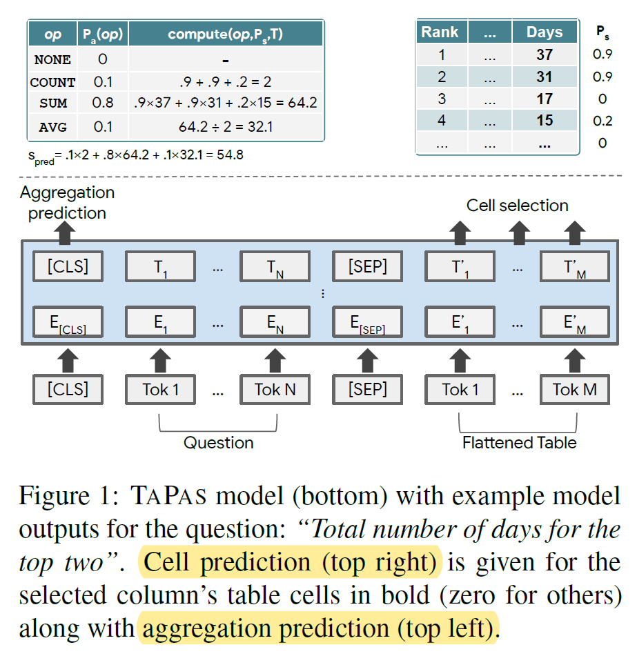
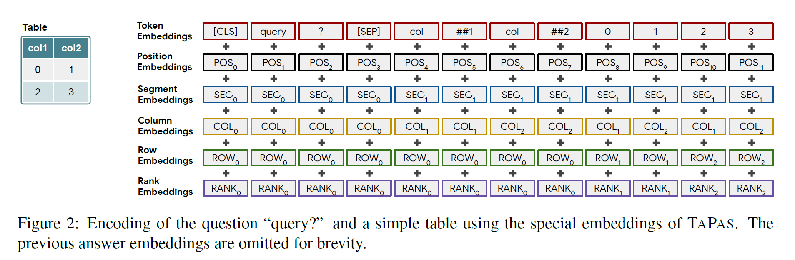

## TaPas论文阅读笔记

2021.9.12

### TaPas
论文：《TaPas:Weakly Supervised Table Parsing via Pre-training》

ACL2020

Tapas是一种不需要生成逻辑表达式，直接通过表格回答问题的方法。TaPas从弱监督中得到训练，并通过选择表格单元格和选择性地应用相应的聚合运算符来预测结果。TaPas在Bert的结构上进行扩展，使用表格作为输入，利用从Wikipedia爬取的表格和文本片段进行端到端的预训练。

代码：https://github.com/google-research/tapas

**论文指出之前研究的问题：**

1.通常将和表格相关的问答任务看作是语义分析问题。而语义分析的数据的标注的代价很昂贵。

2.语义分析生成的逻辑表达式只是获得答案的中介，反而生成逻辑形式有许多问题：解码器约束、标签偏差等。（注：where子句可交换顺序）

**论文创新点：**

1. 提出TaPas，一个弱监督的表格问答模型，跳过了生成逻辑表达式的步骤。通过选择一种不需要生成逻辑表达式，直接通过表格回答问题的方法。扩展了BERT的结构，不需要额外的编码来捕获表格结构，最后仅接两层分类器来对表格单元和聚合运算符进行问题答案的预测。

2. 提出Tapas的预训练方法。在Bert的遮罩语言模型上做了扩展。在文本段和表格上遮罩部分token，通过文本和表格上下文来预测被遮罩信息。

3. 提出端对端的弱监督训练方法。从单元格中挑选构成子集，然后进行特定的聚合操作。

**优点：**

结构简单，在三个不同的语义分析数据集上，效果超过了其他的语义分析和问答模型。

---

#### 模型

编码、取单元格、聚合副预测。总体结构：

##### 编码

TaPas基于BERT，并添加了额外的位置embedding用于针对表结构做编码。

将表格平铺（flatten）成单词序列，并将单词分割成wordpiece（token），将其连接到问题token之后。

在被送入模型之前，token embedding需要与位置embedding进行结合，模型使用了位置embedding：

+ 位置ID：token在序列中的索引（与BERT相同）
+ 片段ID：有两个值：0表示描述，1表示表头和单元值
列、行ID：列、行的索引值。0表示自然语言描述
+ 序数ID：如果一列的值可以被转换为浮点数或日期，就将它们进行排序，基于它们的叙述给定对应的embedding（0表示无法比较，1表示最小，以此类推）这可以帮助模型处理涉及最高级的问题，因为单词片段可能无法在信息上代表数字
+ 历史答案：在多轮对话的设置中，当前问题可能指示了之前问题或者其答案，于是添加了一个特殊标记：如果该token为前一问题的答案则为1，否则为0。

添加了两个分类层，用于选择单元格和对单元格进行操作的聚合操作符。

##### 选择单元格

选取表中单元值的一个子集。由于还可能存在聚合操作，这些单元值可以是最终答案，也可以是用于计算最终答案的输入。

每个单元值被建模为伯努利分布，首先计算每个token的logit值，随后计算单元内所有token的logit的平均值作为当前单元的logit值。然后选取所有概率大于0.5的单元格。

此外在单一列中选取单元值可以起到一定作用。模型添加了一个分类变量来选取正确的列，通过计算一列中所有单元值的平均值embedding，经过一个线性层得到该列的logit值。此外还添加了一个单独的列，表示不选取任何单元格。

##### 聚合操作预测

聚合操作包括求和、求平均值等。

为了在不生成逻辑形式的情况下处理这些情况，对预测的单元值给定一个聚合操作符。

操作符由一个线性层选择，在第一个token的最后一层[CLS]用softmax得到选取每一中操作符的概率。

---

#### 预训练####

**训练数据：**

从维基百科中提取了620万条表格和文本数据，包括330万个infobox和290万个WikiTable。并且只考虑少于500个单元格的表（注：局限性）。

**MLM预训练任务：**

类似TaBert，TaPas采用了MLM（masked language model）作为预训练任务。

添加了另一个训练目标：判断表格是否符合文本描述，但是发现对于我们的任务并没有提升。

将片段序列长度限制在一定范围(128)。
这是组合长度的标记文本和表格单元格必须适合这个预算。
为了实现这一点，我们从相关文本中随机选择一个8到16个单词的片段。
首先，我们只添加每个列名和单元格的第一个单词。然后，我们不断添加单词的转向，直到我们达到单词计件预算。对于每个表，我们用这种方法生成10个不同的代码片段

我们遵循 BERT 提出的掩蔽过程。我们对文本使用整个单词屏蔽，我们发现将整个 celi 屏蔽(如果单元格的任何部分被屏蔽，则屏蔽单元格的所有单词部分)也应用到表中是有益的

#### 局限性

+ 只能处理单表，对于多表需要过滤和压缩，只对相关的内容进行编码。
+ 限制了表格大小，无法处理非常大的表。（序列长度512）
+ 不能处理多个聚合（比如：给出参与者平均分大于4的人数）。TaPas在数据集上表现好是说明数据集本身有很大局限

---

**总结：**

TaPas作为一个弱监督的语义解析模型，避免了生成逻辑表达式，并且有效地训练了大规模的“文本-表格”对的数据，成功预测了被遮蔽的词和单元格。

模型可以仅使用弱监督的方法，在语义解析数据集上进行微调。实验结果显示，TaPas的效果能与某些语义解析模型相匹配。

未来的工作：
1. 在multi-table context进行探索
2. 提高用于预训练的表格及描述的质量
3. 探索更多的无监督预训练目标函数
4. 在更多的与表格相关的任务上，如表格描述生成（table-to-text）做探索。
